# MedTech Actuator
## Panel
* Jennifer McCloy - https://slidelinesdr.com / Passport
    * Crisis communications, Fashion label, husband did MBA in Oxford, went to venture capital
    * Friend did not know how to commercialize software; bought their IP; working on MVP2
    * Platformizing
    * Advanced app that had not been shown to anyone; blessing and a curse
    * Over 300 stakeholder interviews; source of pivots - identified key user groups - GPs, sports physios, corporates from sports codes, etc
    * Met co-founder through Chris (app developer) as another advisor - age 70; best advice 'Don't look for the person, look for the skills gap'
* Hitesh Mehta - www.nutromics.com.au 
    * CS,  business in IBM Watson health, Obamacare, Singapore, NDIA
    * 2015 MBA
    * 2 years
    * Seed, prototype
    * Core offering - health & wellbeing; secondarily antiviral detection; 
    * Met partner at Stratygyzer conference
    * Many partners in academia etc. 
* Michael Challenor - https://vitalrace.com.au
    * PhD nanotech and neuroscience
    * Scientist but not an academic - construction industry consulation
    * Vitaltrace core offering: medical device start-up developing novel biosensors to monitor babies during childbirth. 
    * Developed the core tech (sensors), getting animal data. 
    * Contracted a company to do a proof of concept for 10k ; used that to get more research. Got a license to co-develop a solution with a partner (agreed about background IP and expertise access as well as arrangements for forward IP developed during the process)
    * Bio-design, met through that program 
## Lessons
### General
* Focused early on problem with technology (difficult to monitor blood and metabolites), considered everything from microdialysis, chemical sensors etc. Considered licensing/partnering with dutch academics, US companies - was difficult; expensiver, lawyers - decided to develop their own tech. 
* Meeting co-founders:
    * 'Don't look for the person, look for the skills gap'
    * Do the skills gap analysis regularly
* Focus on things costing 
* Patent searches and call people, even overseas (patent searches are extremely high yield)
* Is your solution a pain killer or a vitamin in your market? Pain killer - help sports retain insurance cover; vitamin for parent as it gives peace of mind, prevent hospital presentations, reduced healthcare system burden etc
* Preventing something automatically allows you to save money somewhere; easy to get stats too
* People are always running away or towards something - show how solution does either and for whom
### Advisors
* Sort the weed; many 'advisors' just want a general chat once a week - don't hand over equity unless willing to roll their sleeves up. Advisor vs Advisory board - latter needs KPIs etc.
* Can pay for advice initially to road-test, then decide commercial vs board vs equity afterwards
### Partnering
* Academic partnerships open up grants/government stuff
* Have a whole eco-system approach in finding partnerships
### Sharing idea
* Terrible to keep your idea hidden
* Can have a small aspect of your idea that you keep a bit hidden
* difference between success and not success is execution
* mentor said - If you're at the stage of talking to people about your idea to validate it, you're probably already 12 steps ahead of anyone you are talking to. 
* NDAs not worth much but people tend to do it
    * Hitesh used them well - good screening test about whether you should be talking to someone. 
    * Consider - how easy/hard is it to do what you are doing? 
        * Specifically, can the person you are talking actually do what you are doing? 
        * Do they have the motivation to do it?
* NRL CC'd Jennifer 
#### Michael's thoughts
Nobody cares - everybody is too busy. 
You don't need to disclose your claims
1. how easy is it to do what you're doing
2. can the person you're speaking to do it.
3. Do they have the motivation to do it

### Regulation
* Monitoring versus diagnostic device
* Does it have alarms that alert the clinician to make a particular action?
* Talk to a regulatory/reimbursement expert
* Jenifer - Classed as a type 1A
* Initially Hitesh were going for a non-regulatory pathway but now are planning to go down that path (partly to create a moat - strategic value, forces competitors to spend that time and money)

* Similar skills gap analysis when it comes to joining accelerators or other programs (e.g. do you need help for regulation)
* Not everyone needs to do the same program if you have a good skills sharing

# Clarifying your value proposition
* We help x do y by doing z - with a focus of how *customers define your value*. 
* Spotify - soundtrack your life. Let spotify bring you the right music for every mood and moment.
* Pain vs gains - gain is not just the reverse of pain, can think of it as the what happens above the 'work to be done'. 

# Lunch-n-learn
Jess
* Kick-started for love your body - $25,000
* Mostly use Instagram - FB's algorithms hide a lot; so best to join communities. Sought a demographic that was important.
* Puts a lot of effort in engaging with people with larger followings
* I did this thing, can you have a look and let me know what you think. I noticed that you did X & Y - make it clear that you respect and know what they do. 
* Had a publicist that helped for traditional media
* Re public speaking: it's not about you, it's the message
* Important founding story 
* Have those talking points if you are heading towards Tv 
* Jots down some notes about stuff she cares about rather than - her social post about not calling people pretty all that time (but also giving alternatives)

# Innovating in a time of crisis
## Schedule and speakers
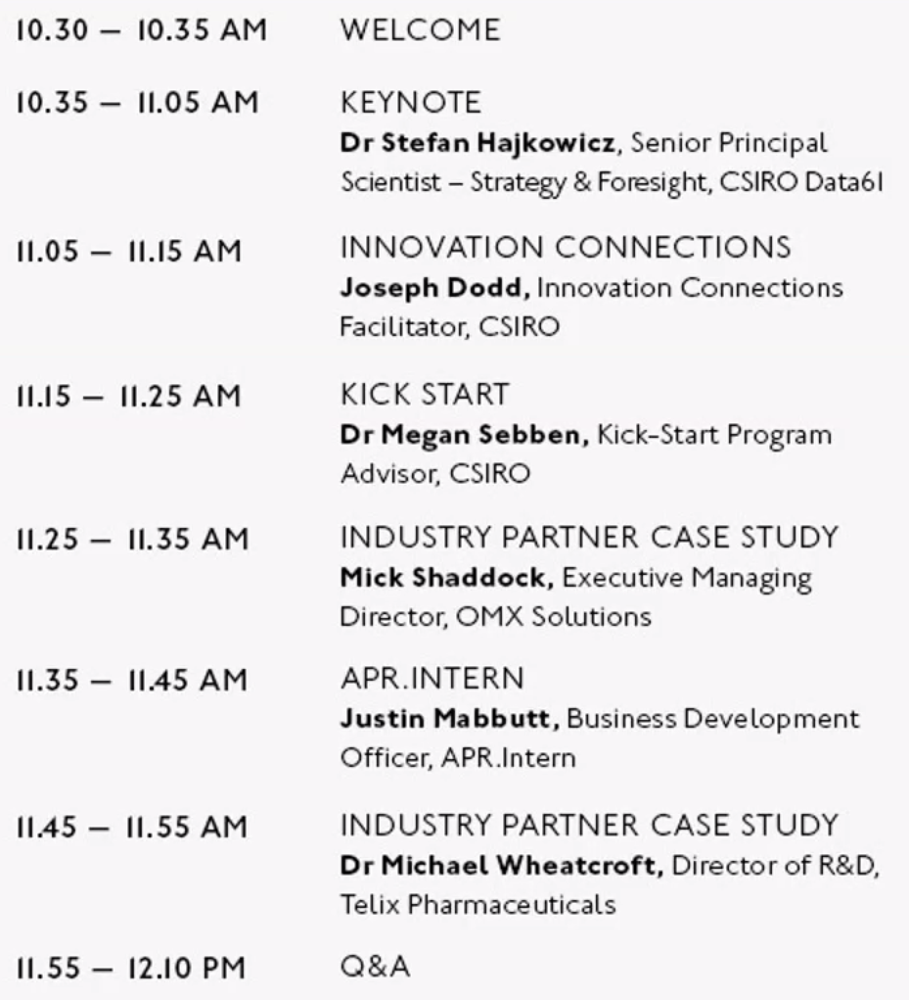
## Stefan
### Economics overview
Every month of containment takes 2% off GDP
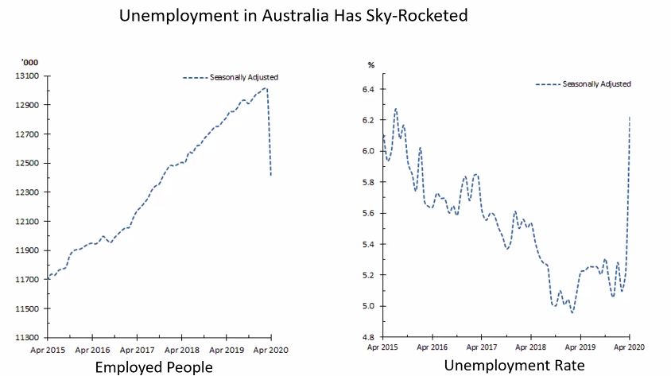
* 14.7% unemployment rate in the USA - highest
* Heading into with unprecedented debt
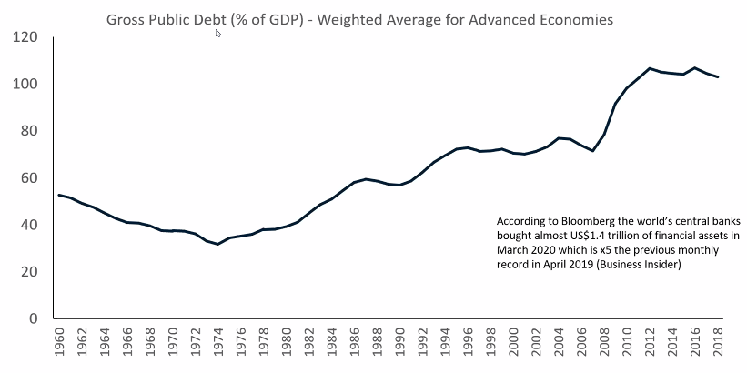
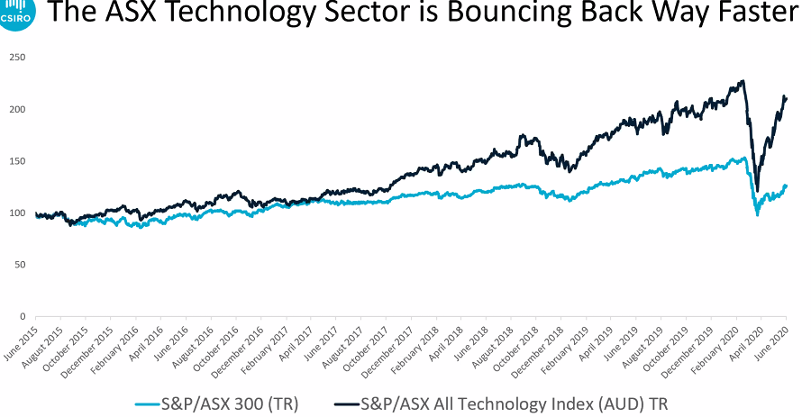
* Coles had a 24% jump of online sales; Woolies recruited 5,000 third party couriers
* Atlassian - $411.6 million increase
* 1.2 billion young people in 186 countries in partial or online remote studying
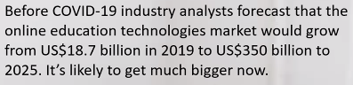
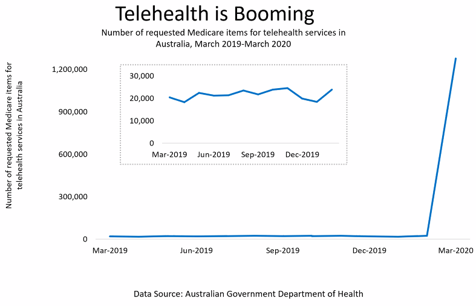
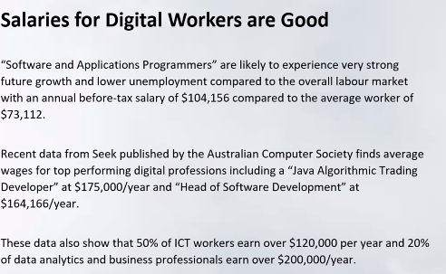
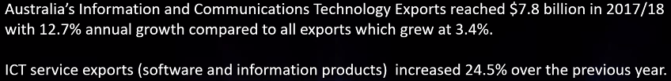

### Silver linings
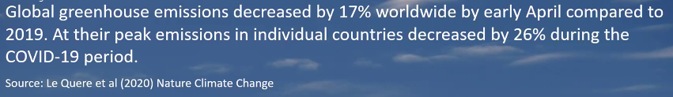
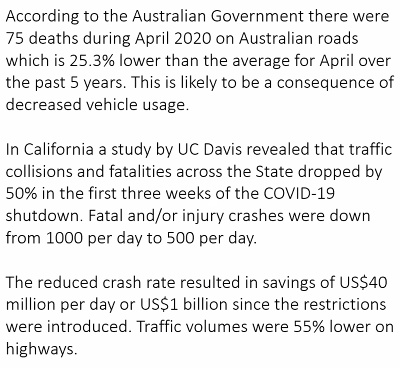

## Path forward
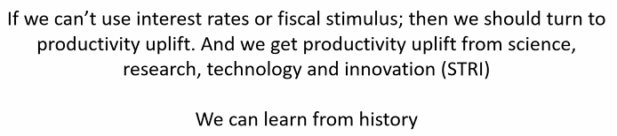
* Main reason for roaring 20s was the general application of electricity, a technology that created an increase in efficiency. 
* General purpose tech for 2020s are AI, digital technology and genetics
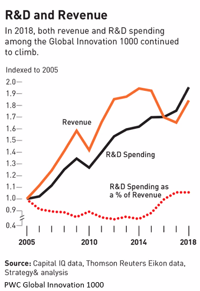
* Companies and ocuntries that invested in R&D came out of the GFC more quickly

## Joseph Dodd
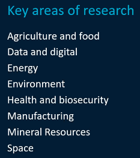
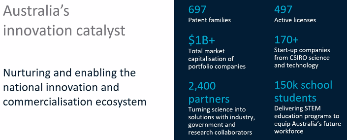
* Focus on commercialization 
* They have an SME connect program, with 3 funding programs - CSIRO Kick-Start; Innovation Connections & STEM+ Business
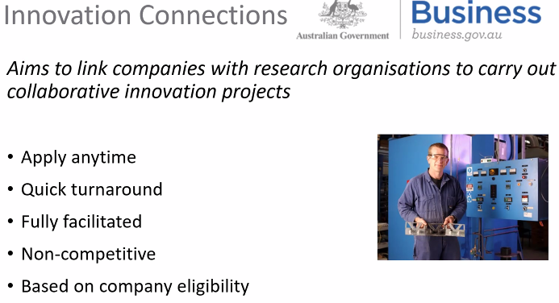
* Guaranteed entrance if you meet eligibility
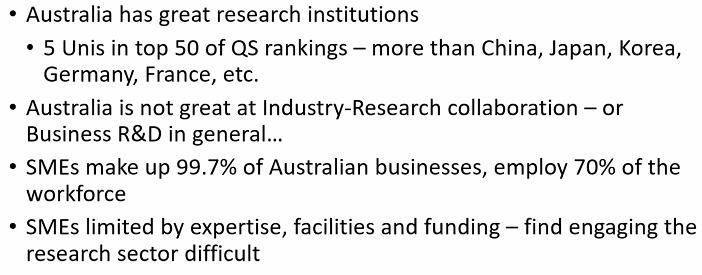
* Great unis, almost the worst in OECD in private R&D, therefore innovation connections
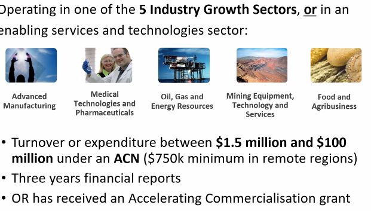
* Innovation connection grants
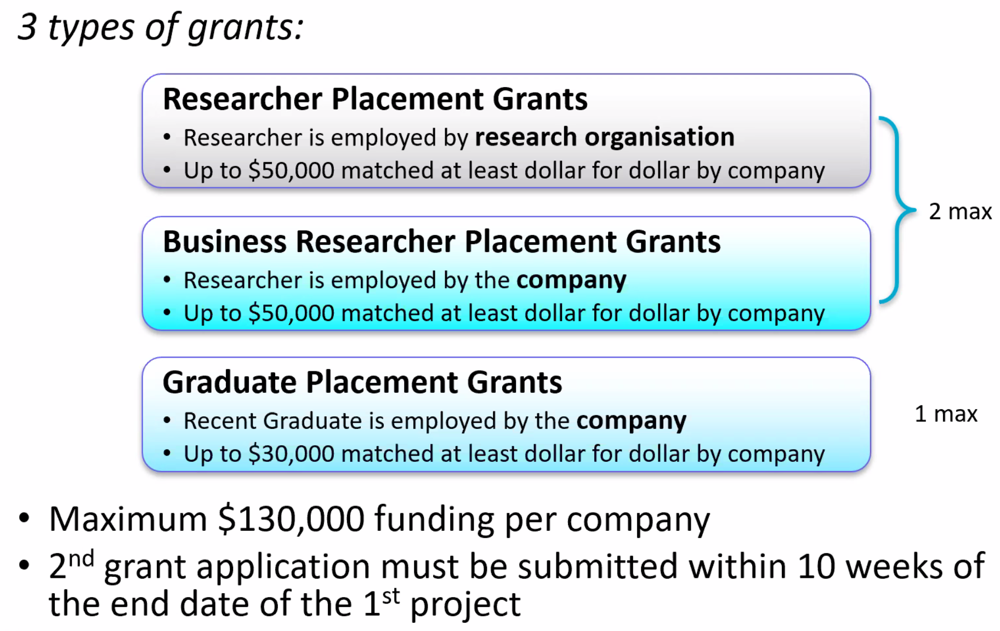
* CSIRO kick-start is for start-ups
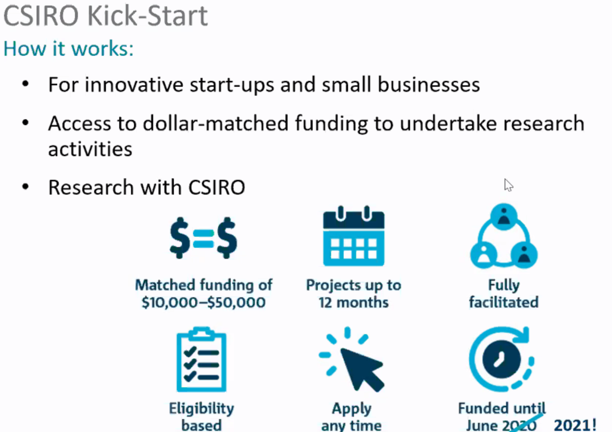
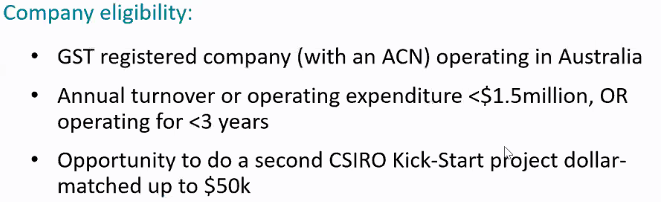
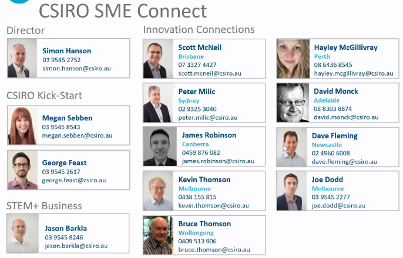
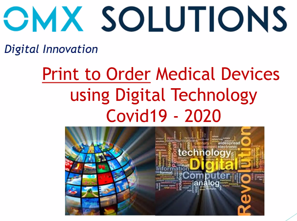

# Resources
## Customer discovery recap
### Ultimate guide to kickass customer interviews
[Source](https://www.userinterviews.com/blog/the-ultimate-guide-to-doing-kickass-customer-interviews)

### Great customer interview questions
[Source](https://www.productplan.com/product-managers-12-great-customer-interview-questions/)

### Interviews in new vs existing markets
[Video](https://vimeo.com/groups/204136/videos/73674022)

### Customer discovery
[Part 1](https://vimeo.com/groups/204136/videos/75308828)
[Part 1](https://vimeo.com/groups/204136/videos/75184102)
[Part 1](https://vimeo.com/groups/204136/videos/75603393)

### Techniques for empathy interviews in design thinking
[Source](https://webdesign.tutsplus.com/articles/techniques-of-empathy-interviews-in-design-thinking--cms-31219)

### How to conduct user observations
[Source](https://www.interaction-design.org/literature/article/how-to-conduct-user-observations)

### How to conduct multi-person interviews
[Video](https://vimeo.com/groups/204136/videos/76175265)

## Data to insights
### Extracting inishgts from data
[Video](https://vimeo.com/groups/204136/videos/76177502)
* The aim is to speak to a volume of customers to understand the product/market fit; match your potential customer segments with the features each is after. Might require pivots till you understand customer archetype and an MVP that matches customer need.
* Ideally you also understand from this the channels, partners and customers acquisition, activation and retention strategies, my costs, metrics for success

### Getting the MVP right
[Video](https://vimeo.com/groups/204136/videos/73713162)
* You're essentially running a series of expertiments on a range of customers to get the data you need
* An MVP is not a smaller/de-featured version of the whole product, it is the shortcut of learning
* E.g. start-up selling drone imagery to farmers to increase yield - farmers want the data, not the means; so you can test by putting a camera on a stick and running across their field or a low-flying plane.

### Pay attention to the outliers
[Video](https://vimeo.com/groups/204136/videos/76177672)

### How to write personas
[Source article](https://medium.muz.li/what-are-how-to-create-personas-step-by-step-guidelines-of-everything-49357da2cb59)
[Video](https://www.youtube.com/watch?v=u44pBnAn7cM)
* Finctional representation of a cluster of your target customers of meaningful commonalities based on  your user research. Map it with an empathy map. 
* Mearketing vs UX personas: UX based on goals, aspirations and motivations. Marketing is useful for segmenting and targeting. 
* Should limit the number of personas to 1-2; they're an aggregation. Too many means you will lose focus of your core user group, makes it harder to guide. 
* Speak to at least 5 people for each prsona/product type. 
* Focuses you on the needs and wants of the target consumer
* Conducting the research
    * Ask questions about their personal life like where they live, what they do in their spare time, what are their favourite brands
    * Technical background and employment questions like how do you spend your typical weekday, what software and tools do you use in your typical day, what devices do you use at work, how many hours each day, how do you manage your hectic schedule
    * Professional questions about their needs and goals, what are your goals? How do you plan to achieve those goals? What do you need to achieve those goals? 
* Steps
    * Start with a picture
    * Name so you can refer to them as a real person while deciding
    * Quick bio
    * Quote - maybe about something that is important to her; motivations
    * Brands that are important to her
    * Add behaviours - e.g. uses insta and twitter to keep up with the latest goals; not afraid of hard work
    * Goals - wants to enhance productivity
    * Pain points - what are their frustrations. E.g. since Jane freelances, each client makes her have an email account with their company. She has a hard time keeping track of each. 
    * Personality - e.g. 
    * Motivations
    * Post it all over the office so people are regularly reflecting it
    * Personas expires every year; have to keep them relevant
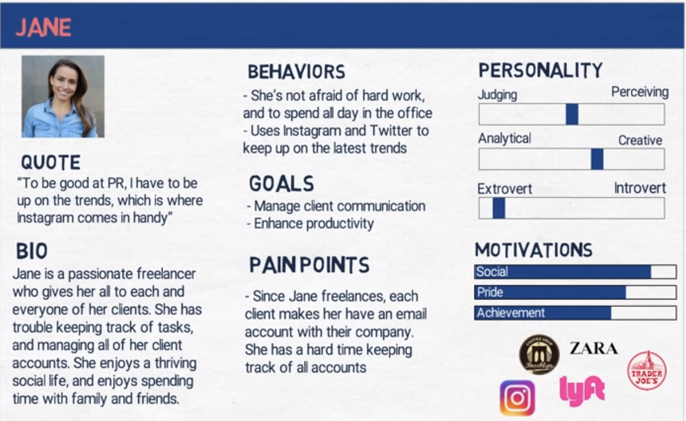

### Customer journey map
[Video](https://www.youtube.com/watch?v=X7iXcP-wIkk&t=38s)

### Customers' job to be done
[Source](https://hbr.org/2016/09/know-your-customers-jobs-to-be-done)
[Source](resources/Customers-Jobs-to-Be-Done.pdf)
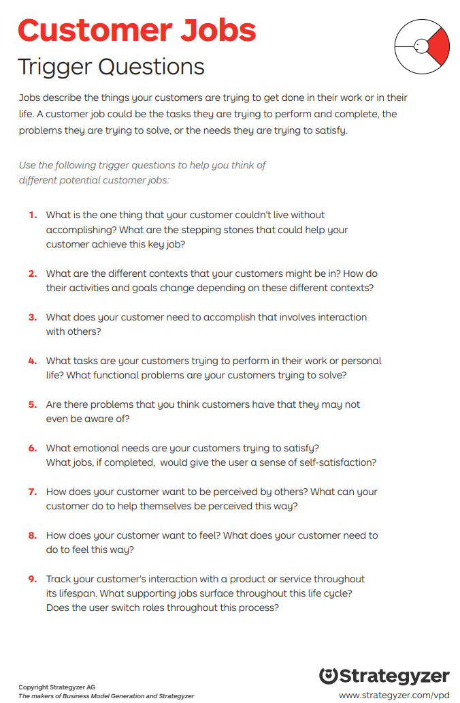

## Value proposition

### Value proposition as a statement
[Source](https://www.investopedia.com/terms/v/valueproposition.asp)
* the value a company promises to deliver to customers, a declaration of intent introducing company's brand to comsumers 
* A value proposition can be presented as a business or marketing statement that a company uses to summarize why a consumer should buy a product or use a service. This statement, if worded compellingly, convinces a potential consumer that one particular product or service the company offers will add more value or better solve a problem for them than other similar offerings will.
* Communicates a easy-to-understand reason why a customer should buy a product or service from that particular business and serves as a core value to be used internally to make decisions
* Should include main customer, customers' problems, uniqueness of the benefit and why it's better. Benefit must be valuable to the audiece.
* The ideal value proposition is to-the-point and appeals to a customer's strongest decision-making drivers.
* it should always be displayed prominently on a company's website and in other consumer touch points
#### Successful structure
* A successful value proposition typically has a strong, clear headline that communicates the delivered benefit to the consumer. The headline should be a single memorable sentence, phrase, or even a tagline.
* Often a subheadline will be provided underneath the main headline, expanding on the explanation of delivered value and giving a specific example of why the product or service is superior to others the consumer has in mind. The subheading can be a short paragraph and is typically between two and three sentences long. The subheading is a way to highlight the key features or benefits of the products and often benefits from the inclusion of bullet points or another means of highlighting standout details.
* Added visuals increase the ease of communication between business and consumer.
### Alternate view: Fundamental component
[Source](https://www.invespcro.com/blog/value-propositionwhat-is-it-how-it-works-and-why-you-should-pay-attention/)
* In its most basic form, a value proposition is a summary of how your product or service benefits your customers.
* But beyond that, it presents the most compelling reasons why a prospective buyer should become a customer and highlights a benefit or feature that sets you apart from every other company in the market.
* process can be challenging because they need to be distinct, concise and interesting. 
* As you write your value proposition, think about what you’d want to say if you were sitting across the table from a prospect, having an informal conversation. Never try to impress a potential customer with a language they don’t use.
* It's not an ncentive, a catchphrase or a positioning statement
* as soon as they arrive on your website, your value proposition tells them everything you offer quickly, while you have their attention.
#### Preparing
Research the following
1. What you offer
* Specific explanation of what you offer from POV in a way that appeals to them; directly addressing their needs, incorporating their phrasing
* Can include key stats here, e.g. how much $/hours customers have saved
2. Who you serve
* Established persona
3. What differentiates you from customers
* Look at their websites and ask
    1. What are your competitors lacking?
    2. What do you do better?
    3. Why do these differences matter to your customers?
* In sum, make sure that your value proposition resonate well with your customers and that you are able to deliver on it!
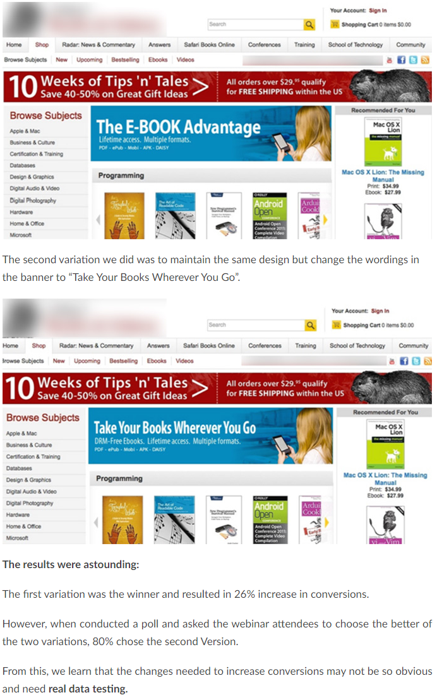
#### Creating
1. Aim for simplicity, avoiding industry jargon at all costs. 
2. Make it memorable. Incorporate unique language, even if it's just one word. 
3. Convey the value. Although your differentiating factors may be features like great customer service or a user-friendly interface, it’s important to also highlight how your business helps customers achieve a specific goal.
#### Testing
* Must test your value proposition
* If placed side-by-side with your biggest competitor’s value proposition, is it clear why a potential customer should choose your business?
* Instead of relying on people who are already customers or aware of your business, ask people who are unfamiliar with your brand to read your value proposition. Ask them what their impressions are, if they are clear on what the product is, and what the benefits are to the ideal customer.
* Consider A/B testing
#### Examples
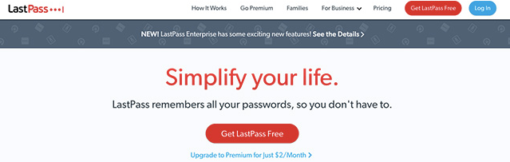
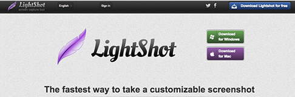
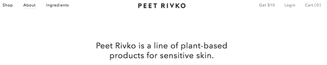
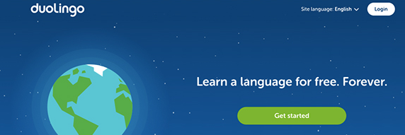

### Startygyzer
[Source](https://strategyzer.uservoice.com/knowledgebase/articles/1194370-how-do-i-use-the-value-propositions-building-block)
* Your Value Proposition describes the bundle of products and services that create value for a specific Customer Segment.
* Ask yourself the following questions:
    * What value do we deliver to the customer?
    * Which one of our customer's problems are we helping to solve?
    * Which job are we helping the customer get done?
    * Which customer needs are we satisfying?
    * What bundles of products and services are we offering to each Customer Segment?
* Value Proposition is an aggregation, or bundle, of benefits that your company offers customers. They come in various types, which may be quantitative (price, speed of service) or qualitative (design, customer experience). Elements that can contribute include:
    * Newness - satisfy new set of needs customers previously didn't percieve as there was no similar offering
    * Performance - E.g. PCs
    * Customization - Tailoring products and services to the specific needs of individual customers or segments. Think mass customization and customer co-creation. 
    * 'Gettin the job done' - value from helping customer gets certain jobs done well. E.g. rolls royce for airlines, they pay per hour so they can get on with the things they need. 
    * Design 
    * Brand/status - Rolex vs underground
    * Price
    * Cost reduction - reducing costs the customer would usually have
    * Risk reduction 
    * Accessability - making a product or service available to customers who previously lacked access. NetJets for example had fractional private jet ownership. 
    * Convenience/usability - iPods etc

### Value proposition canvas
[Canvas](/resources/Value-proposition-canvas.pdf)
[Canvas](https://static.ecoach.com/uploads/unit/89013/tile/2068554/2a327cc4ea587a712c6959cfa186c1815df401a2.pdf)
[Video](https://www.youtube.com/watch?v=ReM1uqmVfP0&feature=emb_logo)
* Customers don't care about 72% of products entering the market
* This canvas consists of a customer profile, used to track, test and visualise the groups you intend to create value for: 
    * describe jobs the customer wants to get done - functional like getting somewhere; social like impressing colleagues; emotional like peace of mind 
    * pains, negative outcomes people want to escape like dissatisfaction with current products, risks, obstacles
    * gains, how customers measure success for a job well done, can include benefits and aspirations
* And a value map:
    * List the products and services your value proposition builds on
    * Describe the ways in which these are pain relievers (how they make their life easier)
    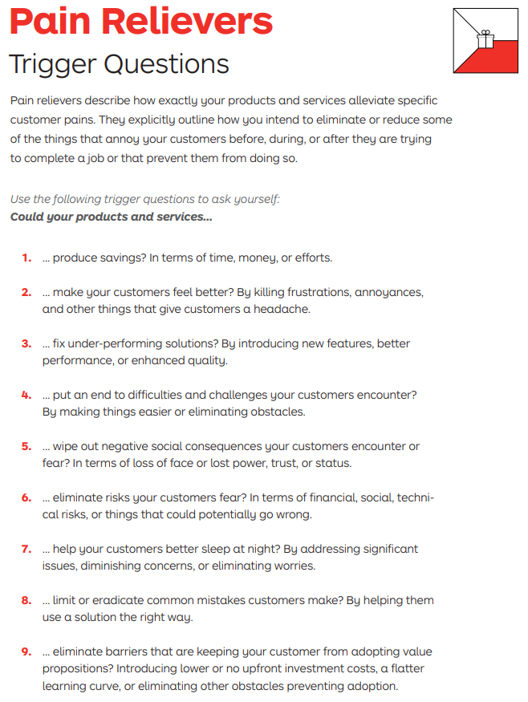
    * Describe the ways in which these are gain creators (how they produce or maximise outcomes that the customers expect, desire or would be surprised by)
    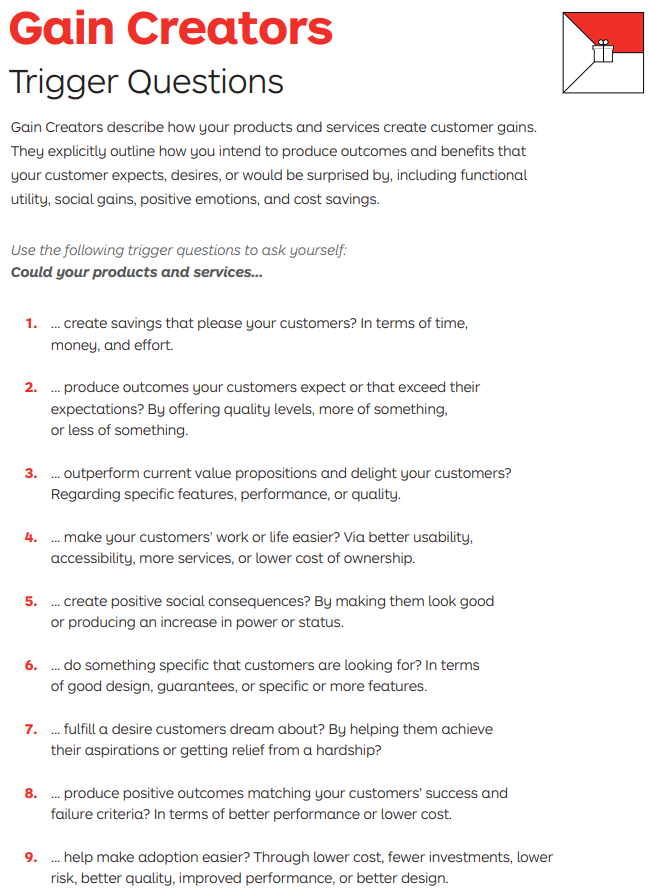
Achieve fit between the two. The value map highlights which of the customer pains, gains and jobs your product/services focuses on. 
[Instruction manual](https://static.ecoach.com/uploads/unit/89013/tile/2068554/d046b8776668bd840b1e09737aad15b41b0af899.pdf)
[Instruction manual](/resources/Value-proposition-canvas-instructions.pdf)
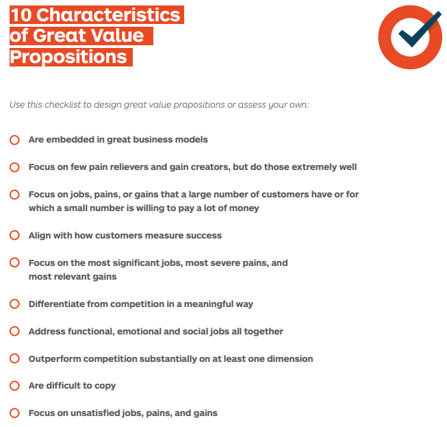

### VP Examples
[Instructions with examples](https://cxl.com/blog/value-proposition-examples-how-to-create/)
[7 Good examples](https://www.wordstream.com/blog/ws/2016/04/27/value-proposition-examples)
[31 examples + video](https://www.impactbnd.com/blog/value-proposition-examples)

## MVP and Business model canvas
### Making sense of the MVP
[Video source](https://www.youtube.com/watch?v=0P7nCmln7PM)
[Written version with examples](https://blog.crisp.se/2016/01/25/henrikkniberg/making-sense-of-mvp)
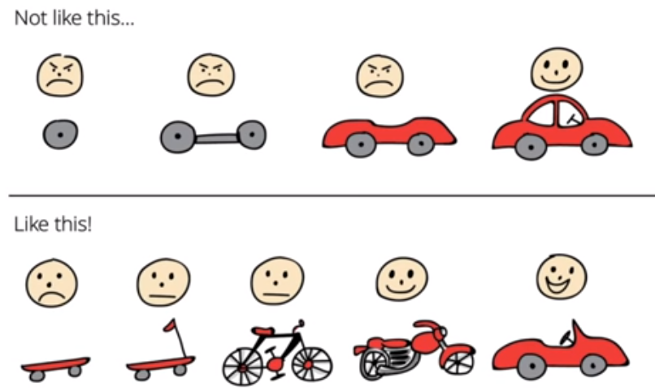
* Iterative development aka agile
* Focus on the underlying need - I need to get from A to B faster
* Deliver the smallest thing that achieves that goal first, so the user can start testing. 'The earliest testable product'. The main goal at this point is just to learn. We're not trying to make the customer happy at this point.
* What is the cheapest and fastest way we can start learning? Could we give a bus ticket instead of a skateboard?

## Business model canvas instructions
[Source - video](https://www.youtube.com/watch?v=QiWXzo04e6s&feature=emb_logo)
[Source - web](https://diytoolkit.org/media/Business-Model-Canvas-Size-A4_2.pdf)
[Source - local](/resources/Business-Model-Canvas.pdf)
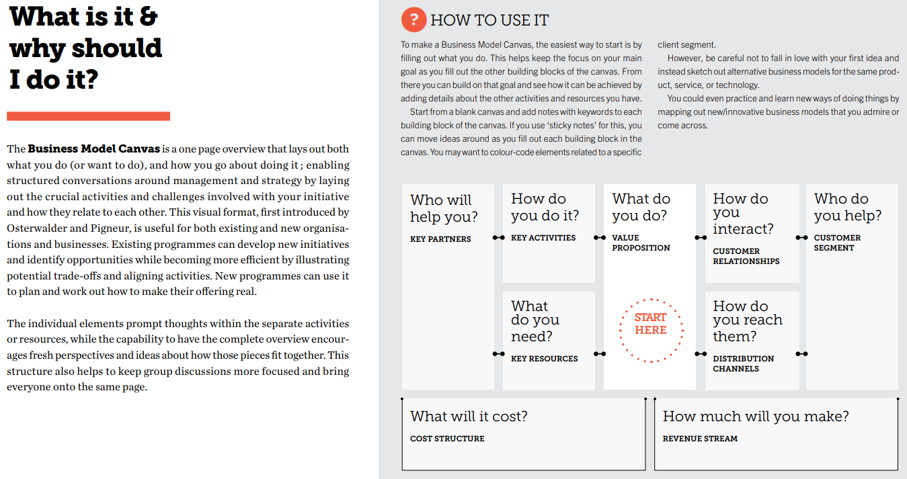
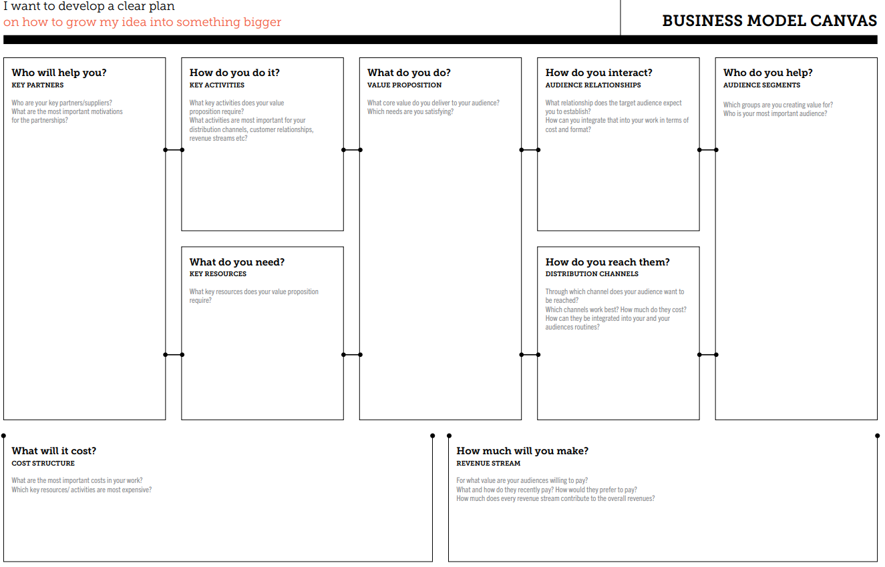

### Kawasaki's tips
[Guy Kawasaki's take](https://www.youtube.com/watch?v=xajtsedb9NY&feature=emb_logo)
* Which companies want our service and WHO actually
* Ask women, men have the 'killer gene', they want to create a company/business model that kills another, a 'microsoft killer' etc. 
