# How to Innovate - Antler
Lim Kwanghui (MIT PhD) joined.
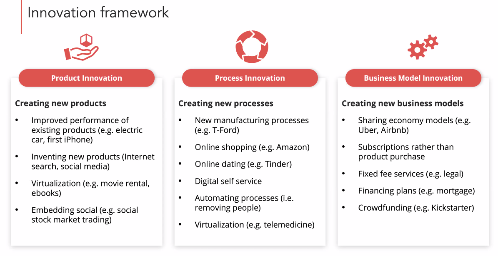
* Often, there are no substantial first-mover advantages (e.g. Encyclopedia Brittanica printed for 244 years)
* Eric Yuan - Zoom, video conferencing considered 'done', given WebEx, Skype, BlueJeans, Google Hangout, Facetime. Canva was first angel investor. Eric worked for WebEx, frustrated that his ideas were not being acted upon. His visa was rejected 8 times. 
* Electric scooters has too low barrier of entry, so Antler does not invest in them.
* UpWork, TaskRabbit, Fiverr, Airtasker (Australian)
* They like business models where there can be a decoupling between costs and profits (e.g. what's the cost of an extra 1000 units? E.g. for tinder to make another 100k matches, easy)
* Subscribe to NfX podcast 
* Startup 
* Business model innovations: Ride sharing vs Taxis and vs car ownership
* Sticky revenue models favourably viewed by investors e.g. 
* Hotwire; de negoce 'discounted pig-in-a -poke; Robin Hood (invest for free - hard for competitors to follow you because they will cannibalise their own business model)
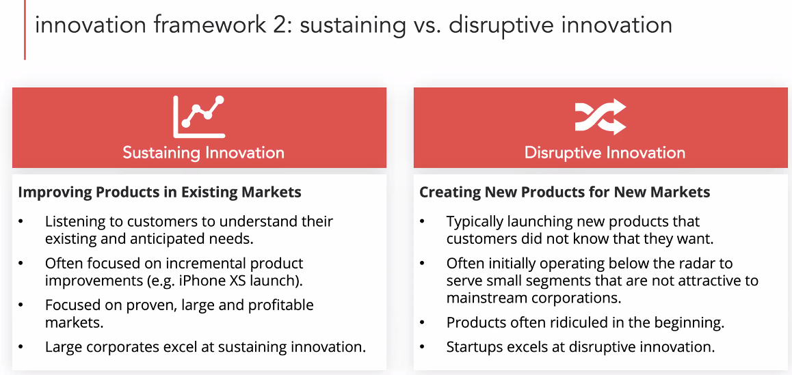
* As a disruptor, you are often initially offering an inferior product initially but it's a lower price point or servicing a specific innovation.
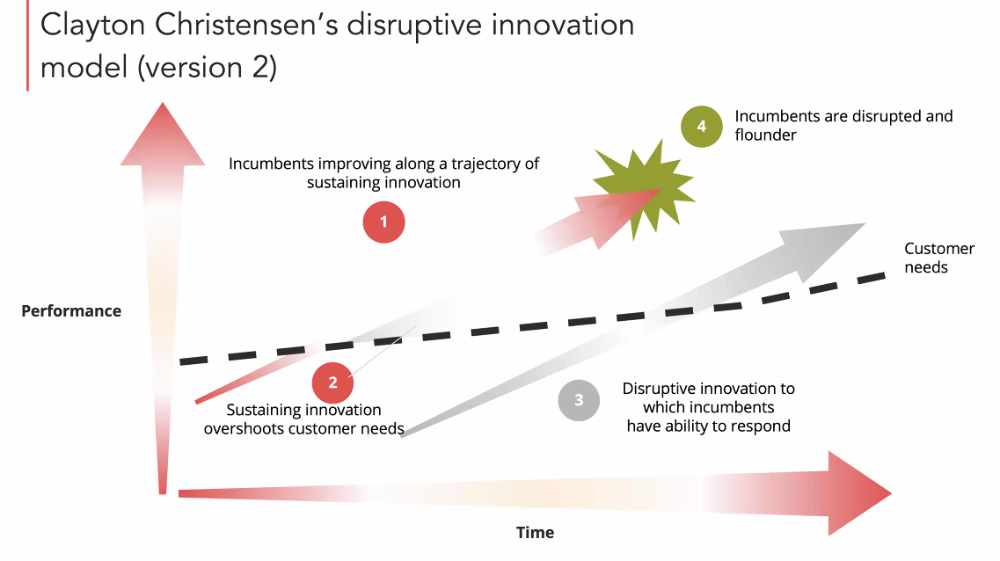
* Idea is companies will overshoot customer needs over time (products keep getting better each year)
## Valuations
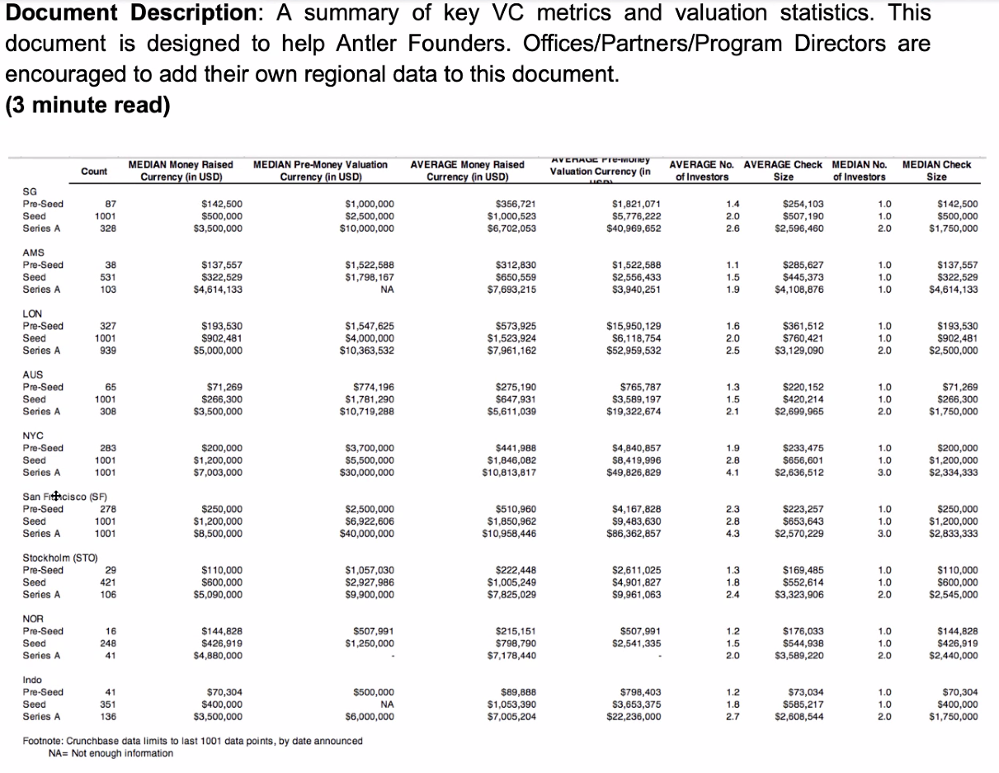
* Variation is about supply and demand rather than economic valuations
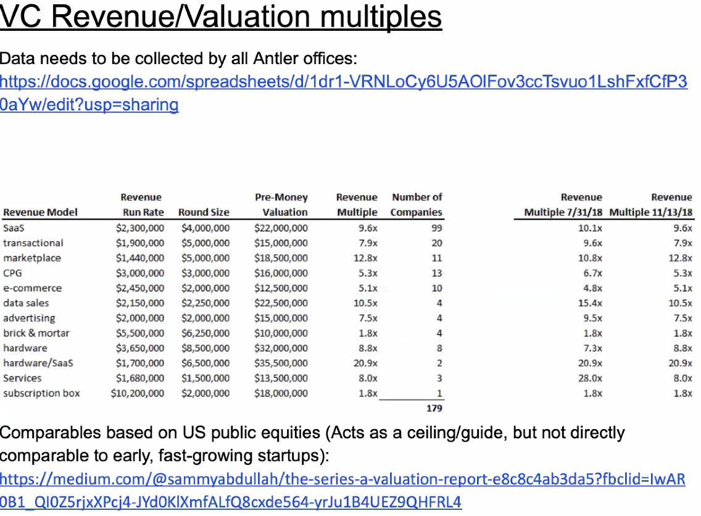
* BtoC - target 7% week on week growth (Graham from Y combinator) - by focusing on growth, you will know very quickly if something is wrong withy your company.
* On early stages, focus on surrounding yourself with well-tested people who exemplify the culture and values you want. 
* Think critically about people's mindset, e.g. Masters of Scale - B2C companies; not a big risk - but if you're doing hardware, this is suicidal. What is it that thi s author has built and invested in?
## B2B
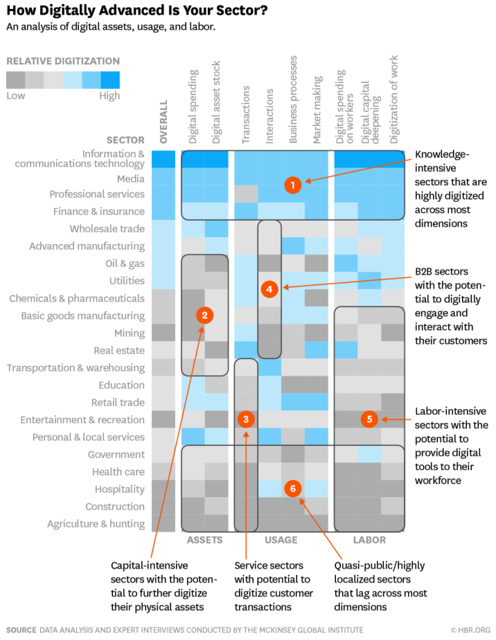
* [Source for above](https://hbr.org/2016/04/a-chart-that-shows-which-industries-are-the-most-digital-and-why)
* Focus on companies in the bottom half, who can't hire top talent because they are un-exciting so they need to either buy start-ups or spend a lot on management consultants
## Kwanghui Lim advice
Excellent advice from Andreas. Porter's Five forces is good. I suggest for those interested to take a peek at any strategy text such as Frank Rothaermel's Strategic Management book, or Robert Grant's. Some of it is about managing big firms, but the parts about analysing the industry is very useful for startups. You need to understand the industry landscape and competition in order to succeed
Other good resources: (a) Bill Aulet's book on entrepreneurship - fun and easy to read. BIll runs the MIT entrepreneurship Ctr. (b) Tidd and Bessant's book on innovation - heavier, more detailed.

## Recommended readings
### [Paul Graham](http://www.paulgraham.com/growth.html)
* Start-up = new company built for growth - needs to (a) make something lots of people want and (b) reach and serve all of those people; growth is your guiding compass
* Larry Page and Sergey Brin wanted to search the web. But unlike most people they had the technical expertise both to notice that existing search engines were not as good as they could be, and to know how to improve them. Over the next few years their problem became everyone's problem, as the web grew to a size where you didn't have to be a picky search expert to notice the old algorithms weren't good enough. But as happened with Apple, by the time everyone else realized how important search was, Google was entrenched.
* Starting a start-up is initially just a declaration of ambition, a pole not a threshold. In that, it's similar to being an actor. <mark>At the beginning of his career, an actor is a waiter who goes to auditions</mark>. Getting work makes him a successful actor, but he doesn't only become an actor when he's successful.
* Measure growth as the ratio of new customers to existing ones. If you're really getting a constant number of new customers every month, you're in trouble, because that means your growth rate is decreasing. At Y-Combinator they measure weekly growth.
* The best thing to measure the growth rate of is revenue. The next best, for startups that aren't charging initially, is active users. That's a reasonable proxy for revenue growth because whenever the startup does start trying to make money, their revenues will probably be a constant multiple of active users. Suggest a growth rate of 7%. 
* Focusing on hitting a growth rate (optimization problem) reduces the otherwise bewilderingly multifarious problem of starting a startup to a single problem. 
* In theory, you could end up in a local maximum but actually doing is better than not-doing and founders' intuition of which hill to climb next is generally accurate. Plus the maxima in the space of startup ideas are not spiky and isolated. <mark>Most fairly good ideas are adjacent to even better ones.</mark>
* The reason VCs like to invest in startups is not simply the returns, but also because such investments are so easy to oversee. The founders can't enrich themselves without also enriching the investors.
* Why do founders want to take the VCs' money? Growth, again. The constraint between good ideas and growth operates in both directions. It's not merely that you need a scalable idea to grow. If you have such an idea and don't grow fast enough, competitors will. Growing too slowly is particularly dangerous in a business with network effects, which the best startups usually have to some degree.
* It's not just that if you want to succeed in some domain, you have to understand the forces driving it. Understanding growth is what starting a startup consists of. What you're really doing (and to the dismay of some observers, all you're really doing) when you start a startup is committing to solve a harder type of problem than ordinary businesses do. You're committing to search for one of the rare ideas that generates rapid growth. Because these ideas are so valuable, finding one is hard. The startup is the embodiment of your discoveries so far. Starting a startup is thus very much like deciding to be a research scientist: you're not committing to solve any specific problem; you don't know for sure which problems are soluble; but you're committing to try to discover something no one knew before. A startup founder is in effect an economic research scientist. Most don't discover anything that remarkable, but some discover relativity.

# MAP Launch
* max.mito@

# Resources
## Business model canvas
[Summary](https://www.youtube.com/watch?time_continue=10&v=CakUeC1sCSs&feature=emb_logo)
[Fitzroy academy](https://www.youtube.com/playlist?list=PLTYTquYYeup-Epik1JRF0aR3Oc5_0yOmy)

## Example business models
[Video](https://www.youtube.com/watch?v=CHxHsg8wGiY&feature=emb_logo)
1. Unbundling business model
    * 3 types of businesses may co-exist within a single corp, which all have different aims etc. They can conflict.
        * Customer relationship business
        * Product innovation business
        * Infrastructure business
2. The Long tail
    * Long tail business models are those that sell more of less - key to success is low inventory cost and strong platforms. E.g. Lulu and Lego Factory
    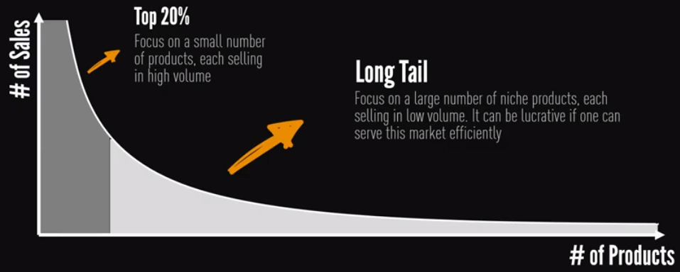
3. Multi-sided platforms
    * Bring together two or more distinct but interdependent groups of customers
    * 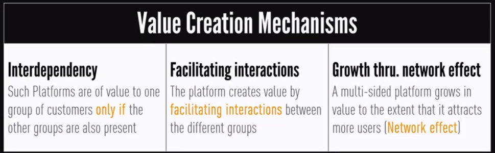
    * They create value by facilitating interaction
    * e.g. Google 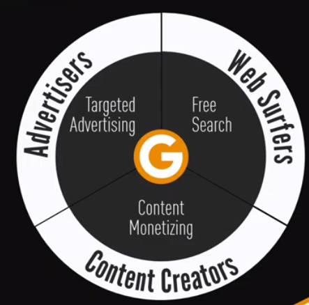
4. Free as a business model
    * At least one concern
    * Based on multi-sided business (e.g. MX, free newspaper), freemium (flickr) or bait-and-hook (Gilette)
5. Open business models
    * Systematically collaborate
    * 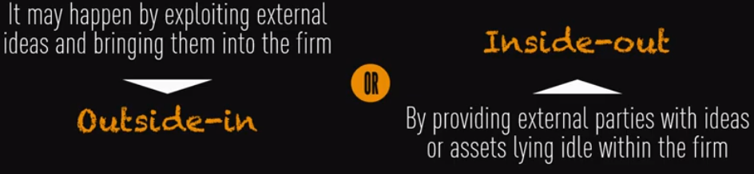
    * 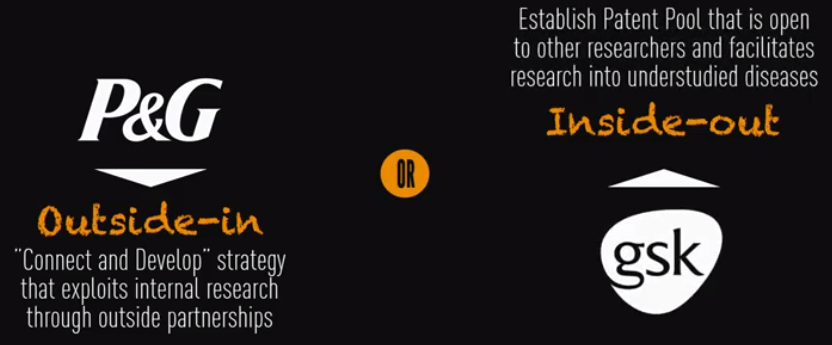

[More examples](https://www.marketing91.com/23-types-of-business-models/)

## One idea, many business models
[Joshua Gans @ TedX](https://www.youtube.com/watch?v=CgiOylmT6OA&feature=emb_logo)
* Restroom finding idea - Sit or squat
* National public toilet map - just Australia
* No business model to gather that data
* Instagram - to take a good picture easy and share it
    * Hipstermatic sold millions - a few months prior, $4.99
    * IG didn't have model, was just giving it for free. 
* Idea is different from the business model
* Centre LMS on newsfeed
    * Course-sphere - pivoting to corporate

* Experiment with business models
* Experimenting with business models are not free (e.g. hard to raise cost later)
* KIRA Talent - for webcam asynchronous interviews, initially thought they'd charge potential employees to pretty themselves up but then switched to charging the employers, asked the prof 'how would you use this?', maybe to recruit MBA students

## Ways to Test Your MVP by Chris Bank
[Source](/resources/Ways-to-test-your-MVP.pdf)

## How to plan an MVP
[Source video](https://www.youtube.com/watch?time_continue=2&v=1hHMwLxN6EM&feature=emb_logo)

## Validation board
[Template - online](https://static.ecoach.com/uploads/unit/88711/tile/2202609/2416d8e2beb1f1f695f86a3ffab94a0fb0b588a8.pdf)
[Template - Local](resources/validation-board.pdf)
[Video instructions](https://www.youtube.com/watch?v=HhoducyStMw&feature=emb_logo)
* Top of the board
    * Helps you track your progress
    * A startup's runway is the number of pivots the company can still make it
    * Want to decrease time and money spent between pivots
        * YouTube started as a datings site
        * Instagram - location based social network
* Bottom left is where you design and experiment (your product is an expertiment with the goal being to understand your customers)
* Bottom right
### Steps
1. Define the customer (group of people with a common pain) and the specific problem (the way )
2. Design your MVP by asking yourself, what must we learn? Do this by:
    1. Asking what are the core assumptions of our business?
    2. Prioritize: Which assumptions are the riskiest (if it's invalidated, the company is going to fail)
    3. Ask: What experiments do I need to build to test this risky hypothesis? Three approaches from cheapest to most expensive - do them all in order:
        1. Exploration - reproduce problem, e.g. by doing customer interviews, understanding pain points etc.
        2. Pitch - collect currency (e.g. email addresses, cash)
        3. Concierge - delivery customer expectations
3. Define the minimum success critieria, asking how do we measure success? 
    1. Decide on the weakest outcome you will accept as validation (minimum success criterion) to continue working on this product
4. Get out of the building and experiment
5. If invalidated, pivot the hypothesis
6. If validated, brainstorm and test the next riskiest assumption