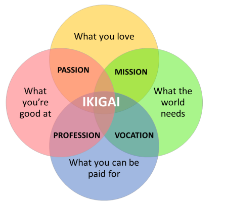
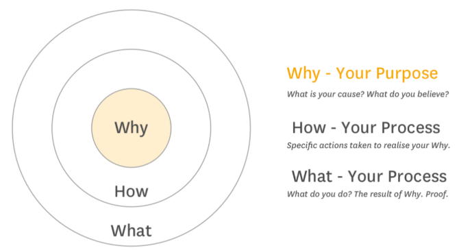
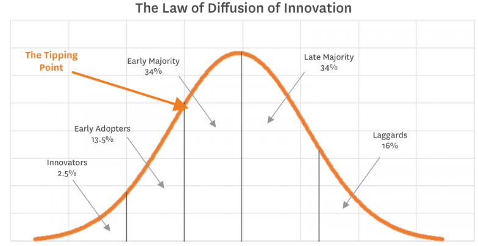
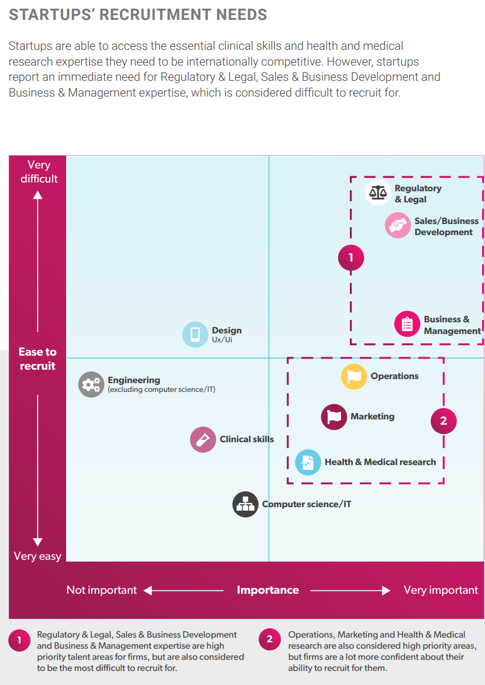

# Induction
## Things to look up
* Lunch and learn - fortnightly Tuesdays @ 1230 - 1300
* LinkedIn, Slack & Strava
### Community abassadors

### Key elements

### Program

## Homework
### Reflect on purpose and values
### Introduce

# Entrepeneur showcase
## Farhad Goodarzy
PhD '14 -> epilepsy -> Nura headphones -> Neurobit

## Shivy Yohanandan
bionics institute -> IBM research -> fastest and smallest AI for computer vision
Looked for partner

## dam Jahnke
2015 grandfather fall, ericson, cochlear, MPH. Looking at transdisciplinary hiring; initial sales as a validation of value (will people pay for this) -> block funding from a philanthropist -> contract with an aged care provider which was also. 
* Writing down the goals heading into these programs
* Slowing down to speed up
* Compare yourself to others only where it is productive    

## Joseph Roccisano
Biomedical engineering -> masters in data science -> fitcus
* when finally narrowed his key target audience, it was easier to make a more concise pitch (define your ideal customer well)
* 'growth hacker'; advertising (too initimidated to go to the gym?)

# Resources
## Solving the right problem
If I were given one hour to save the planet, I would spend 59 minutes defining the problem and one minute resolving it” Albert Einstein said.

Author from [InnoCentive](http://www.innocentive.com/) proposes challenge-driven innovation model.

> Use the 5 whys to help

e.g.
*InnoCentive staffer:* “Why do you need the lubricant?”

*Client’s engineer:* “Because we’re now expecting our machinery to do things it was not designed to do, and it needs a particular lubricant to operate.”

*InnoCentive staffer:* “Why don’t you replace the machinery?”

*Client’s engineer:* “Because no one makes equipment that exactly fits our needs.”

This raises a deeper question: Does the company need the lubricant, or does it need a new way to make its product? 

### Advantages
* Rallies org around shared understanding of he problem, rationale and level of resources to dedicate
* Assign a value to the org
* Widens net for potential solutions, enabling multidisciplinary input by escaping the narrow definitions

### Process
* Choose a **problem champion**, who have a deep understanding of the field or domain and be capable program administrators. Because problem champions may also be charged with implementing solutions, a proven leader with the authority, responsibility, and resources to see the project through can be invaluable for a larger strategic undertakings.

1. Articulate the need for a solution in the simplest terms, e.g. “We are looking for X in order to achieve Z as measured by W.”
    * What is the basic need? The essential problem?
    * What is the desiered outcome? Understand the perspectives of customers and other beneficiaries and address qualitatively, quantitatively and specific wherever possible, e.g. “improving fuel efficiency to 100 mpg by 2020”
    * Who stands to benefit and why? Helps identify all potential customers and how they may define success. **If the problem you want to solve is industrywide, it’s crucial to understand why the market has failed to address it.**
2. Justify the need
    * Is it aligned w/ org strategy? 
    * What are the desired benefits for the company, and how will we measure them?
    * How will we ensure that a solution is implemented? Have a high-level discussion about the resources required so constraints are considered early.
3. Contextualize the problem
    * What approaches have we tried? What have others tried? (traditional research, interviews, field testing)
    * Revisit resources and commitment (support for soliciting & evaluating solutions and $ & people to implement the most promising), as well external constraints like laws, regs, patents etc.
4. Write the *Problem Statement*
    * Captures everything learnt from previous steps, aimed at establishing a consensus on what a viable solution would be and required resources. Some tips:
        * Is the problem actually many problems? Find root causes.
        * What requirements must a s olution meet?
        * Which problem solvers should we engage?
        * What information and language should the problem statement include? **Specific but not unnecessarily technical**, no industry/dscipline specific jargon or presuppose knowledge of a particular field. Should include a summary of previous solution attempts and detailed requirements. For example:
        > “EnterpriseWorks is seeking design ideas for a low-cost rainwater storage system that can be installed in households in developing countries. The solution is expected to facilitate access to clean water at a household level, addressing a problem that affects millions of people worldwide who are living in impoverished communities or rural areas where access to clean water is limited. Domestic rainwater harvesting is a proven technology that can be a valuable option for accessing and storing water year round. However, the high cost of available rainwater storage systems makes them well beyond the reach of low-income families to install in their homes.A solution to this problem would not only provide convenient and affordable access to scarce water resources but would also allow families, particularly the women and children who are usually tasked with water collection, to spend less time walking distances to collect water and more time on activities that can bring in income and improve the quality of life.”
        * What do solvers need to submit? What info do you need in order to invest in it? Hypohetical approach? Full prototype?
        * What incentive do solvers need? Internally could be into job descriptions, promotions, bonuses. External could be a cash reward. 
        * How will solutions be evaluated and success measures?

## Finding your Ikigai (Reason for being)

[From this worksheet](/resources/ikagi.pdf)
### What am I good at?
* Connecting with new people and maintaining relationships
* Bringing people together
* Knowledge of a wide range of fields
* Seeing connections between things
* Seeing the silver lining
* 'Getting stuff done'
* knowing when to cut my losses
### What do I love?
* Reaching a new understanding of something about a person or the world
* Connecting with interesting individuals or knowledge
* Seeing something I had a hand in creating, whether it's a relationship, a process, a product or even a party or event going well.
* Teaching and helping others grow with the knowledge and understanding I've gained over time
### What is my passion?
* Passion is using my knowledge to achieve positive change in the lives of other people and systems in a way that allows me to step towards 'the next thing', i.e. new people and understandings
### What the world needs?
* My organisation needs someone to show that change is possible. That there is a viable alternative to just complaining about the way things are over lunch with colleagues and that daring to do something about problems you identify can be both possible and satisfying.
* More broadly, my industry needs creative ways of doing things. We have a lot of societal pressures working against us:
    * Aging population
    * Tightening budgets
    * Increasing burden of disease
    * Difficulty scaling our interventions
    * An uncertain scientific foundation
### What is my mission?
* My mission is to bring people together to inject some multidisciplinary creativity into mental healthcare.
### What can I get paid for?
* Seeing patients
* Writing reports
* Teaching
* Consulting
* Basic product development
* Leading teams within healthcare
### What is my vocation?
* Psychiatrist
* Consultant
* Entrepeneur 
* Health innovation salesman
### What is my profession?
* Psychiatrist
### What is/are my ikigai?
* Thought leader
    * Credibility with decision makers
        * Publications
        * PhD
        * Track record of success
* Do-er
    * Real skills and ability to make things
        * Projects
        * Connections with other do-ers

## Purposeful enterprise example
### Article quotes
* [Article](https://www.virginstartup.org/how-to/why-its-important-know-your-startups-direction-and-purpose)
* [How great leaders inspire action](https://www.ted.com/talks/simon_sinek_how_great_leaders_inspire_action)
* > Initially my thought process was design then launch, but as my research and concept progressed, I realised that it wasn’t going to work to make one product and as just pop it on Kickstarter. It needed to be about a concept that I was passionate about and that no matter what hurdles I came across I would continue with.
* > I loved reading books like Bounce by Mathew Syed, Contagious by Jonah Berger, and of course the man himself, Richard Branson!

## Start with why
* [Video](https://youtu.be/sioZd3AxmnE)
* [Summary of his book](https://www.freshworks.com/freshsales-crm/resources/summary-of-start-with-why-blog/)

* Essentially, he argues that most companies and people communicate in the realm of 'what', which speaks to type II thinking and 'how' and forget about the why besides 'to make $'. But making money should be the result. People don't buy a product or follow you because of *what* you offer but because of what you *believe*, **why** you do what you do. The *what* then becomes *proof* that you do what you believe. The Tivo example was good: It became a verb but was not successful because they focused on the what. 
> We have a device that lets you pause, reward & fast-forward live TV, skip ads etc

* Instead, they could have said: 
> If you are the kind of person that likes control over everything in your life, boy do we have a product for you . It lets you pause... 

* They would then be selling a belief, that people should be able to do this or, further, that their target audience *need* to be able to do this. Martun Luther King had a *dream* not a *plan*. A why the country had to move, not a what it needed to look like.

**Applied to me:**
I believe that large health organisations can listen and change for the better. If you believe that, follow me. 

The other useful part of this talk was this graph, making the point that innovations only succeed if you can reach the tipping point where you win over the early and late majority, the 67% that sit in the middle of the bell curve of adoption. The innovators (2.5%) and some of the early adaptors (13.5%) are often where good products stop. It's only once you reach the tipping point entering into the majority do movements develop. The laggards, meanwhile, will only shift once you can no longer do things the old way. Get to know the laggards only enough to know not to waste time and money on them. So the tipping point is about 18% market penetration.

## Before I do I want to...
* [Video](https://youtu.be/uebxlIrosiM)

## Founder's silent struggles
[Articles](https://medium.com/ofounders/founders-silent-struggle-part-1-37e32639d865)
> Many times the initial idea has to mutate multiple times looking for the perfect fit that is not only workable but the most importantly sellable and scalable.

> “Spend more time speaking with users from the first steps of the product or service development so you would not have a chance to fall in love with your creation that is not working” one of the significant learnings that, Tommaso Troiani, founder of swabit.app had.

> Communicating effectively ideas and visions with a team, investors, and customers is an art that has to be mastered daily.

> A clear understanding of the root of the failure and making everything that needs to be done attitude helped many to recover from painful setbacks.

> The most significant resources lie in access to as diverse as a possible network of experts. Networking is not about creating a quantity but quality relationships. Would it be asking for advice, referral, assistance, investment, joining your team or even making a sale — you have to know what value you can generate for them that they really care about.

> There is always an incline to paint a nicer picture in order to get the results “easier”, “faster” or being able to move forward at all. The startup culture is soaked in the “fake it until you make it” mindset. People are becoming wary of believing each other.
Credibility needs time and it’s built by staying true to your word through actions as small as not being late or calling when promised.

## HealthTech report for LaunchVic

Therefore probably also people I need to target for my consulting pool. Regulatory/legal, sales/business development. 