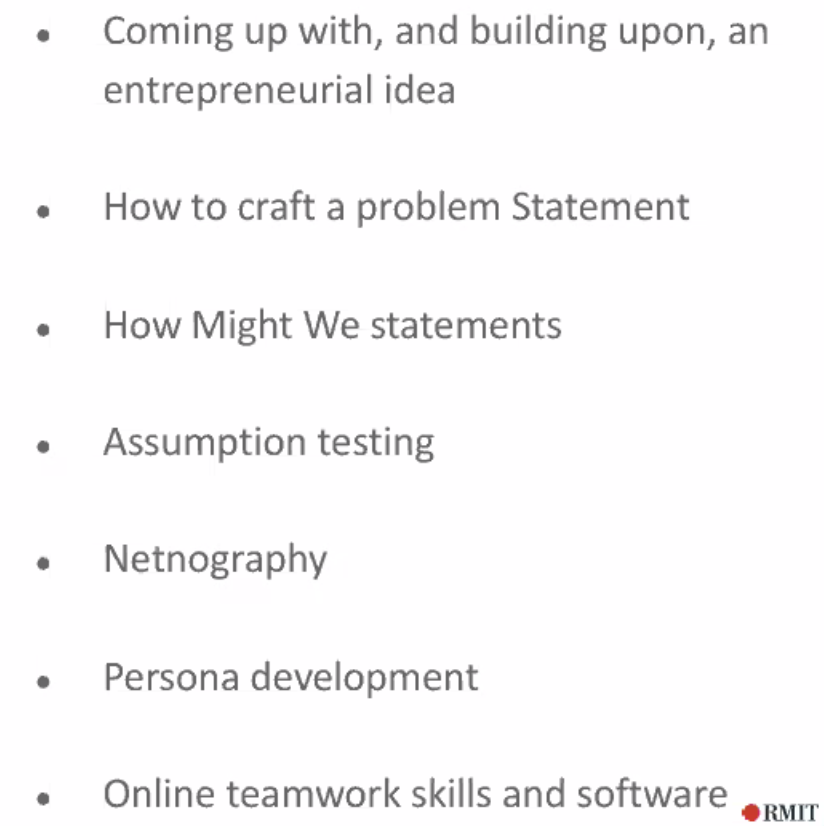
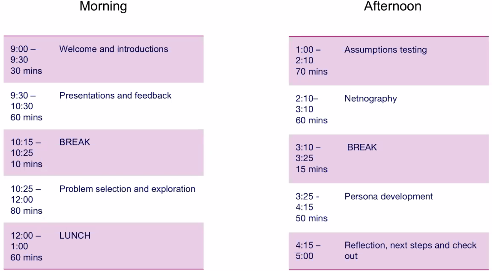

# IGNITE workshop

## Agenda

## Boards
[Team 1](https://miro.com/app/board/o9J_ktxinDU=/)
[Team 2](https://miro.com/app/board/o9J_ktRkfdA=/)
[Team 3](https://miro.com/app/board/o9J_ktRkffM=/)
[Team 4](https://miro.com/app/board/o9J_ktRkfZs=/)
## How might we statements?
- Help to step away from the solution you have in mind to see if there are the other
- Or use it to pick up specific parts of the solution you have in m ind
Opens up your thinking.

* How might we identify the groups at risk?
* How much we identify people are about to injure themselves?
* How might we inform people they are potentially injuring themselves?
* How might we ensure people pay attention to that information?
* How might we convince people they need this?

How might we identify and measure fatigue, its source and accurate detection and effectively communicate it to the user before critical point.
* Measure it through sweat; identify its source by getting the user to nominate it or marketing it for a certain use case, accuracy through user testing - starting with a heuristic but build in data collection that could later use a machine learning approach. Communication needs to be 'timely' and available, so smartwatch is good.

Ask: 
- what if statements?
- yeah but?
- have you thought about?

Niche markets:
- size of the market?
- value of the market?

## Netnographic approach
Like ethnography, join web communities about certain things

## Persona
About creating a fictional individual to personify your target audience - who is the problem whose problem you are trying to solve? Name is central to bring them to life.

Be the in-laws for others' persona - question the persona

Typical behaviours, name, occupations, age, gender, cultural background, expected income

## People
### Dylan 
- Learning designer, pedagogy etc

### Sunil
- Sweat test: Previously developed test - non-invasive, temperature, pH, glucose, lactate. Link to wearable. (integration of the electronic and the wearable; privacy/security; conversion of thereading into actionable insight)
- Had to rewind and narrow to a problem - heading towards 

### Ravi
Smart fabrics

## Lessons
- Fun and easy to think about solutions, need to keep returning to the problem space (what is the problem, who are you solving it for?)
- 'we are not meant to be islands when we're solving problems for other people'

## Reflection
- The problem is that Healthcare is facing impossible pressurse yet remains very conservative. They do not know what they don't know. Lack the internal skills. Don't want to pay. 
- Feedback: 
1. the flow of starting with the market, more time spent fleshing out the problem
2. if the 'mantra' is 'no pian no gain' - why is this a problem (I am asking a stupid question on purpose)

# Resources
## The entrepeneurial way
* [Video](https://www.youtube.com/watch?time_continue=14&v=eR-bUfga_EE&feature=emb_logo)
* Being calm in the face of uncertainty
* Start-up as a human body that knows how to manage uncertainty
* Success - capture the value of learning. Innovation accounting, taking account of the efforts
* Learning is productive failure, we know what to do with it -> can pivot, persevere or stop
### The way:

## How To Keep Your Entrepreneurial Spirit Alive As The Company You Work For Grows
[Link](https://www.forbes.com/sites/jacquelynsmith/2013/10/22/how-to-keep-your-entrepreneurial-spirit-alive-as-the-company-you-work-for-grows/#7071ff9ec0d4)
* Entrepreneurial atitude seeks out change rather than waiting to adapt to hange
* “It’s about seeing the big picture and thinking like an owner,” says Michael Kerr
* “To me, an entrepreneurial spirit is a way of approaching situations where you feel empowered, motivated, and capable of taking things into your own hands. Companies that nurture an entrepreneurial spirit within their organization encourage their employees to not only see problems, solutions and opportunities, but to come up with ideas to do something about them.”
* KIND’s de Grandpre says he has worked at big and small companies that have exhibited an entrepreneurial spirit. “It’s all about building a team of people who aren’t afraid to be in the driver’s seat and are equally happy to ride in the passenger’s seat when others take the lead.
* any company can, and should, set a goal to sustain a thriving entrepreneurial spirit. “But, of course, this gets more challenging as businesses grow—because as they do, there’s a tendency to move towards more complacency, increased bureaucracy, increased hierarchy and more complexity.”
* This causes them to become more risk-adverse; more protective of what they’ve established. 
* “Letting people take their ideas and see them through is very empowering and motivating. It is a simple component of the entrepreneurial spirit that must remain alive.”
### Practical suggestions:
1. **Think like an owner.** Employees should feel empowered to make decisions--and employers should let them. “That may require a significant culture shift for many organizations,” Kerr says. “Decision-making processes and approvals need to be simplified; leaders need training in how to hand off the reins; and employees need training, coaching and mentoring to help them confidently grab hold of the reins.”
2. **Champion all ideas.**  “Ask your colleague questions to understand their thinking or build on top of their ideas as it encourages them to remain open and share ideas. Even if you ultimately end up walking away from an idea, they’ll understand why.” "To keep ideas coming from employees, managers need to respond to every idea and every suggestion in a timely and forthright manner so that employees feel their ideas aren’t disappearing into a black hole."
3. **Only recruit those who have an entrepreneurial spirit**
4. **Minimize the rules.** “One of my favorite signs I’ve seen in a workplace: ‘When Policy Fails, Try Thinking,’” Kerr says. “A bloated bureaucracy and unnecessary policy stifles creativity, freedom and entrepreneurial spirit, so as a manager, be vigilant. Go on a rule diet. Create a ‘No Sacred Cows’ committee to look for ways to keep the bureaucracy to a minimum or start a ‘Dilbert Squad’ to seek out and destroy just plain stupid policies that are inane enough they might just show up in a Dilbert cartoon.”
5. **Give people the opportunity to drive.** If a team member comes up with an idea that may not be part of their “scope of responsibility,” help connect them with the right teams and let them bring their ideas to life, de Grandpre suggests. Whether you’re the boss or a co-worker, try to give them that opportunity. “It will expand their skills, thinking and again, drive engagement while ultimately fostering cross-functional teamwork.”
6. **Try to work with colleagues in different departments.** As companies get bigger, departments tend to be segmented off from other departments, losing the diversity of ideas, fresh perspectives and organic innovation that can come from cross-pollination.”
7. **Always communicate.** If employees are indeed being asked to think like owners, then they need the same level of information that owners receive: they need a clear understanding of the big picture including all the costs and relevant financial information. How can employees be encouraged to look for cost-saving opportunities, for example, if they don’t have an accurate picture of all the real costs associated with their business?“
8. **Create a culture of questioning.** Questions fuel the creative process and entrepreneurial mindset, Kerr says. “Perhaps you can open meetings with a thought-provoking question; you can create a board where co-workers can write down any query they may have; or you can pose a question of the month to get everyone focused and thinking about a certain aspect of the business.”

## Australian Research Commercialisation
[Link](https://agfundernews.com/australian-research-commercialisation-broken-fixed.html)

## PhD students should prepare for careers beyond becoming professors
[Link](https://theconversation.com/phd-students-should-prepare-for-careers-beyond-becoming-professors-123328)

## Can the Academic Entrepreneur Save the Ivory Tower?
[Link](https://www.entrepreneur.com/article/234315)

## The Third Way: Becoming an Academic Entrepreneur
[Link](https://www.sciencemag.org/careers/2014/03/third-way-becoming-academic-entrepreneur#)
* Really inspiring stuff, the author became faculty in spain while being a funder of a company near MIT and describes the advantages of mixing the two.

## The Tough Life of an Academic Entrepreneur: Innovative commercial and non-commercial ventures must be encouraged.
[Link](https://blogs.lse.ac.uk/impactofsocialsciences/2016/02/16/the-tough-life-of-an-academic-entrepreneur/)
* More inspirational examples