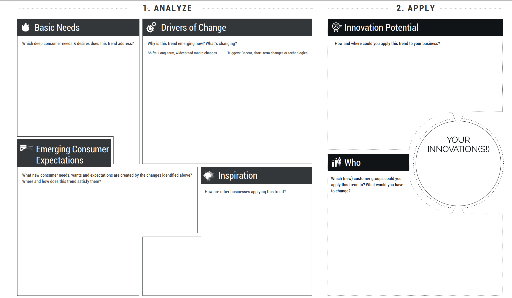
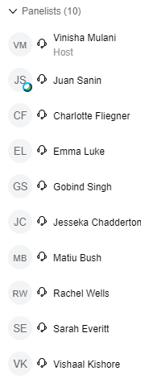

<!-- TOC -->

# TOC
- [Looking for problems to solve](#looking-for-problems-to-solve)
    - [Choice quotes](#choice-quotes)
- [Resources](#resources)
    - [Horizon scanning documents](#horizon-scanning-documents)
    - [Alleywatch](#alleywatch)
    - [Trend-watching](#trend-watching)
    - [Trendhunter](#trendhunter)
    - [Web-hunting for ideas](#web-hunting-for-ideas)
    - [Meta-problems & problem stack](#meta-problems--problem-stack)
    - [The Art of Trend-spotting in 4 steps](#the-art-of-trend-spotting-in-4-steps)
        - [Four step process](#four-step-process)
    - [Introspective approach](#introspective-approach)
        - [Principle](#principle)
            - [Step 1: Define your sources of problems](#step-1-define-your-sources-of-problems)
            - [Step 2: Set problem categories for each source of problems](#step-2-set-problem-categories-for-each-source-of-problems)
            - [Step 3: Dig deep and discover your problems](#step-3-dig-deep-and-discover-your-problems)
            - [Other approaches](#other-approaches)
    - [The perfect customer problem](#the-perfect-customer-problem)
        - [The Hair on Fire Problem](#the-hair-on-fire-problem)
        - [The perfect customer problem](#the-perfect-customer-problem)
    - [Trend Canvas](#trend-canvas)
- [Digital transformation lab](#digital-transformation-lab)
    - [Panelists](#panelists)
    - [Links](#links)

<!-- /TOC -->

# Looking for problems to solve

## Choice quotes
> One **“red flag”** in a business plan is a missing competitive analysis section or a short paragraph that essentially says, “this product has no competition.” My reaction is, if there is no competition, then there is no market demand for your product, so why are you building it?

# Resources

## Horizon scanning documents
[Horizon scanning reports](https://acola.org/programs/horizon-scanning-series/) comissioned by [Australia's chief scientist](https://www.chiefscientist.gov.au/advice-to-government/horizon-scanning)

## Alleywatch
[5 problem to solve](https://www.alleywatch.com/2019/04/what-problem-does-startup-address/)

1. Automate a labor-intensive process. This is the traditional realm of computers. Microsoft Excel applied it to accounting spreadsheets, and Google applied it to information mining on the Internet, but Henry Ford even applied this principle to auto manufacturing. There are still millions of these opportunities for startups out there.
2. Fix something that’s broken. In business, it seems to me that the traditional banking business models are broken or at least no longer fit the purpose. On the other end of the spectrum, Internet dating sites don’t seem to work. There are new ones sprouting up every day, so they must be offering something people want. Yet they work horribly, according to most people who have tried one.
3. Take a luxury and make it a commodity. People must want something if they pay a lot for it. Yet most products can be made dramatically cheaper as technologies improve. This opens the market opportunity, you sell more, and people start to use it in different ways. For example, once cell phones were so cheap that most people had one, people started adding functions and using them as cameras and Internet devices.
4. Make something cheaper and easier to use. Making things cheaper means more volume and more profit. For a long time making things cheaper made them easier, but now even cheap things are too complicated. Computer applications today are cheap, but often still impossible to use.
5. Take a current solution to the next level. Solve the currently intractable problems that impact all of us. Tackle the global warming problem, predict where earthquakes will occur, find alternative energy sources, cure cancer, and unlock the keys to aging. There is no shortage of opportunity here.

## Trend-watching
[Website that keeps an eye on consumer trends](https://trendwatching.com/newnormal)

## Trendhunter
[Emerging opportunities website, subscription based](https://www.trendhunter.com/pro)

## Web-hunting for ideas
'Webscraping' might not be the correct term, but there are many ways to find out what people are searching for or are having problems with.

One way is to use Google or any search engine to search in online communities such as Reddit or Quora. Simply go to Google and start typing:

* “How do I”
* “How do you”
* “Sucks”
* “Can’t seem to”
You'll be surprised how much you find. Obviously, you can be much more specific by either including a topical keyword in your search, or by finding online communities (discussion forums or sub-reddits) that discuss relevant topics. This approach is similar to the Netnography approach we used during IGNITE last week.

There are also tools that can help make this more structured: have a look at Answer The Public. Type in any word or phrase and you get an overview of related searches split up by questions, prepositions, comparisons. Cool stuff.

## Meta-problems & problem stack
[Source](https://medium.com/startup-grind/meta-problems-and-the-problem-stack-ceadb9b26546)
* Businesses exist to solve a problem
* There are multiple levels at which a problem may be solved
* Meta-problems solve problems at a higher level, potentially impacting greater people. Think being an oncologist, vs starting an oncology hospital vs developing a policy framework that redirects funds to cancer research. 
* Founder of stripe says Stripe “builds roads, not cars”. Stripe is building infrastructure (payments via Stripe, incorporation via Atlas) and making it easier for all kinds of businesses to come online more cheaply and more easily.

## The Art of Trend-spotting in 4 steps
[Source](https://www.gartner.com/smarterwithgartner/master-the-art-of-trendspotting-in-4-steps/)

### Four step process
1. Assess the impact of a trend: across industries and geographies - does it offer new business opportunities or negatively impacts existing business models; changes how people work or interact with your organization and its products; or disrupts the vendor market by undermining existing vendors or creating new markets
2. Evaluate Trend maturity: Tech evolves from emerging, growth and mainstream phases so need to separate hype from reality. Adoption need depends on cost and risk of adoption, new capabilities trend offers and security and regulation implications of the trend.
3. Determine market dynamics: The level of investment by venture capital forms, established vendors and early adoption, degree to which the trend, its impact and future evolution and factored into the strategic plan of mainstream organizations. 
4. Make a choice: What do these trends mean for my organization? How should we respond, if at all, and when? Decide whether to:
    1. Ignore the trend
    2. Put it on a list for further monitoring
    3. Continue assessing the capabilities of the trend and react to it

## Introspective approach
[Source](https://othmane.io/writing/how_to_find_problems_to_solve) 

### Principle
Scratch your own itch - intimate understanding of pain points, def solving a real problem and will stick with it way longer. Have to be careful though as many of your own problems are boring, trivial or not powerful enough. 

Suggested steps (use a kanban board):

#### Step 1: Define your sources of problems
* Past and current jobs : Create a list for each job you had as well as your current job, if any.
* Own companies and startups : Create a list for every company or startup you started.
* Current and past side projects : Create a list for every side project you've created.
* Current and past hobbies : Create a list for every hobby you had in the past as well as the ones you have today.

#### Step 2: Set problem categories for each source of problems
Create a card for each of the categories below and paste the description of the category inside the card, then duplicate it across all your existing lists. 

* Time intensive tasks : Tasks you felt you spent way much more time on than you should.
* Cumbersome processes : Processes or tasks where you had to use multiple tools, sites and hacks to get done.
* Inefficient processes : Processes or tasks you thought were inefficient.
* Dreadful tasks : Tasks you hate doing.
* Unused tools : Tools you or your boss paid for but only used less than half of the features.

For example: 

#### Step 3: Dig deep and discover your problems
Open each card and ask yourself 'What [category_of_problems] did I encounter at [source_of_problems].'

Whenever you discover a new problem, add it inside the relevant card using the template below.

1. Name of the problematic task or process
1. A more detailed description of your frustration
1. Would you pay for someone to do it for you ? [ No, Maybe, Definitely ]
1. Is this a problem you'd be proud of solving ? [ No, Maybe, Definitely ]
1. Without doing any research, do you think other people have the same problem ? [ I don't know, Probably, Definitely ]
1. Do you know any people who have expressed having the same problem ? [ No, Maybe, Definitely ]

#### Other approaches
1. Solve other people's problems, eitehr pro-actively asking people about what frustrates them in their professional and personal lives till something stands out OR passively looking for what specific groups are asking for in forums, social networks and reddit/twitter. Maybe start with a list of groups of people you'd like to help, ideally those you identify with or like hanging out with. 
2. Idea extraction, for B2B markets. The [video](https://www.youtube.com/watch?v=a2F-2-I2-5k) and [podcast](https://mixergy.com/listen-to-dane-maxwell-call-a-prospect-and-hear-how-he-extracts-a-profitable-business-idea/)
3. Don't solve problems, just build something fun. Ideally something you and your friends would find very cool, giving you a chance that a lot of other poeple might too.

## The perfect customer problem
[Source](https://www.steveforbes.com.au/blog/2019/7/7/the-perfect-customer-problem)
* Gain a deep understanding of our customer - by getting carried away with your own solution, we make large assumptions believing they understand the customer far greater than they actually do. 42% of startups die because they work on products with no market need, and 70% of all new products don’t meet their revenue targets.
* But speak to a customer about their current world and they will describe a solution for their current context. Think of Henry Ford's faster horse.

### The Hair on Fire Problem
“If your friend was standing next to you and their hair was on fire, that fire would be the only thing they really cared about in this world. It wouldn’t matter if they were hungry, just suffered a bad breakup, or were running late to a meeting—they’d prioritise putting the fire out.

If you handed them a hose—the perfect product-solution—they would put the fire out immediately and go on their way. If you handed them a brick they would still grab it and try to hit themselves on the head to put out the fire. You need to find problems so urgent that users are willing try half-baked, v1, imperfect solutions.”

### The perfect customer problem
[Michael Skok's video](https://youtu.be/6pKW-ehL7dU)
Perfect problem carries these four attributes:
* Unworkable - customer unable to do something significant enough to their personal or business process to seek a solution
* Unavoidable - problemsoften triggered by an event outside the customer's control like regulatory changes
* Urgent - big and painful enough that the customer can't live without a solution
* Underserved - a market with underserved problems means less compettion

**Resist doing any research or jumping to solutions until there are at least 3-5 clearly defined problems**, maybe even stay till you've picked one.

## Trend Canvas
[Source](https://trendwatching.com/trends/consumertrendcanvas/)

# Digital transformation lab

## Panelists

## Links
[MakeZine website showing Covid-19 projects](https://makezine.com/tag/covid-19/)
* Morse code teleconsult in 1874
* Virtual care does not mean diminished care - it is about filling in the spaces left behind by traditional care
* Gaming industry leads the market into 'the next version of the internet' and in engaging virtual spaces
* ? Desk design (Dx), Emma Luke 
* Vishaal Kishore seems to be the director
* Emma Luke - design thinking, auto-ethnography, death design. Frakking simulator in a haptic wearable body-suit
* Sarah Everitt (Medistays) founder, Rachel Wells (journalist): self-isolation accommodation