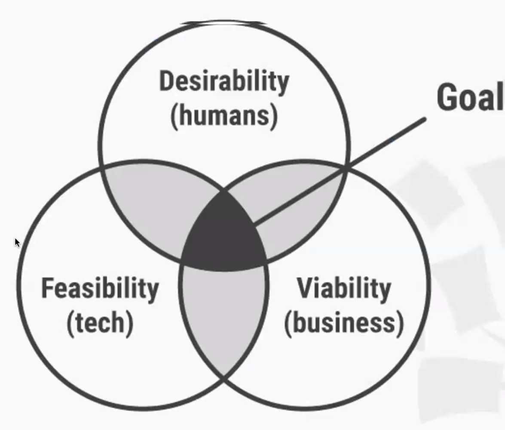
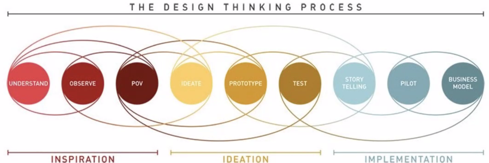
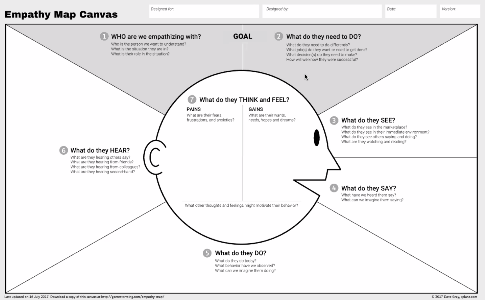
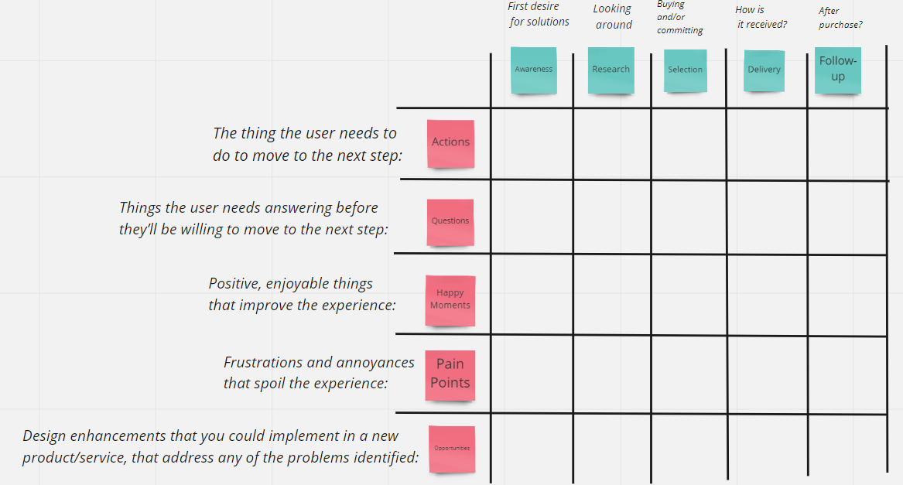
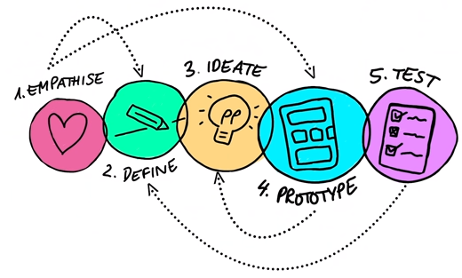
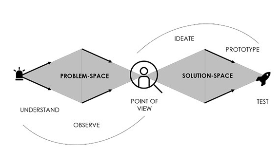
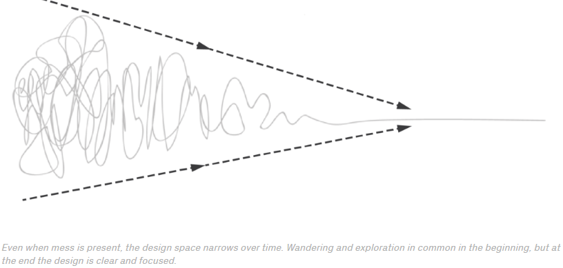
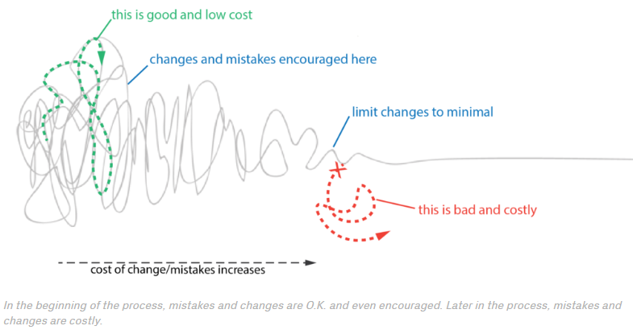
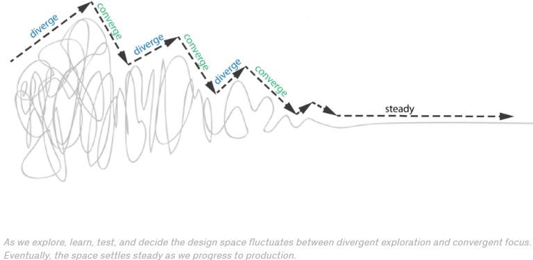
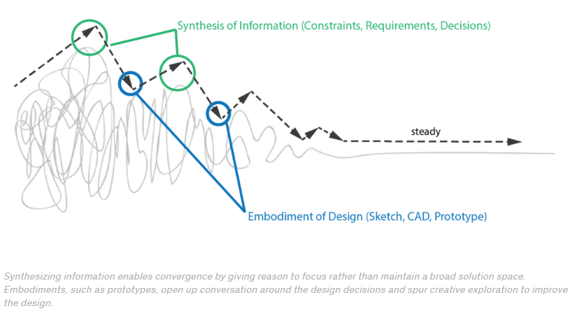

# Design thinking

Fot com era, often there was a focus on feasability, then the viability but then did not have a market.

* journey map is like a process map but includes the emotions, to understand the 'pains and the gains' the customer experiences

* To build this map, ideally you fill it out based on at least 5 customer interviews
* B2B versus B2C customers; think of the end user during design but the pitch needs to be pivoted to the customer. Remember, business model and pitching comes later in the design thinking process. Could also o through the process in parallel for both. At this stage, need to validate that there are enough people out there that have the problem that you have.

# Stand-up meeting
* Learn
* Sofia's PT - concerned about trust of a device. 
* Sharyn - does your fitbit etc interact with you, another way, other forms it could be wearable
* Not a watch
* Ann - players using a wearable - distance, velocity used in training and games, max performance, decrease injury risk. Some teams have been resisting using such devices
* Chiara - that competitor had a scientific committee 

# Cassandra meeting
* Physio, 1 day a week, St V & elsewhere
* Working on Mirena removal

# Sara Lee meeting
* Currently working in neuro rehab, previously public and previous to that general private practice but been many years
* In current role, sees potential for senspire in neuro-rehab, fatigue with a limb. Like muscular sclerosis. Patients struggle to pace themselves properly because of sensory changes so physios have to actually watch them to gauge level of exertion. 
* In previous private, remembers fatigue injuries within the weekend football player, running injuries, and compensible workplace injuries
    * 40-50s ; highly motivaed people doing home exercises
    * 'New you' vs middle aged weekend warriors
* Repetitive movements in workcover - occupational field, e.g. 
    * Lifting / pick and packing jobs - shoulder, wrist, elbow, backs
    * Car factories
    * Overall repeition/endurance based activities. In this setting, men in 20s-60s
    * Can argue prevention is better vs cost of workers compensation, suing, workcover premiums  
* Rating scales used Physio - borg scale of percieved excursion, six minute walk test, walking speed

# Buzz Palmer
* Surgeon -> sophisticated bouncers, stem cells, fat
* Validate the market, customer, beneficiary
* He looks strongly for the level of novelty and whether there is a path to IP
* Talk to at least 100 customers, beneficiaries and end users before you talk to him. Depends on country, e.g. in USA your customer is the insurer and them your end users are the clinicians and patients. Often beneficiary is the patient's carers. In emerging markets, customer often the patient. Here, the admin team of the hospital often the market.
* If licensing out IP, aim for 51% otherwise 30/30/30 is acceptable
* Can't keep IP as soon as it's published. Speak to tech transfer office, IP lawyer. Can pay for an IP, license. To get exclusive rights for a time.
* 90% are first Time entrepreneurs
* People really want preventative, personalised medicine. 
* You need a Spock and a Jim as co-founders; seek the other if you are one
* Can't keep IP as soon as it's published. Speak to tech transfer office, IP lawyer. Can pay for an IP, license. Exclusive rights
* All startups should be thinking about IPO
* 90% in Victoria are first Time entrepreneurs
* Stop and listen is the first step for startups the enter. From regulators. For the first month, don't talk to anyone. Have to get your brand right before you do, only get one chance to speak to co-founders, investors, distributors. If brand was a member of the team, what do they look like, how old are they etc. Each startup partner with one product development company, mentors (corporate and personal)
* He has six mentors he speaks to monthly 
* Peer mentor with Vishal
* Asia Pacific is the biggest market in the consumer space 
* If looking at chronic illness, start with a specific chronic disease. How do you manage the interface with the clinician though? Needs to passive. Asia Pacific and Germany are best for these patient first chronic disease models

# Resources
## Design thinking overview
[Video overview](https://youtu.be/gHGN6hs2gZY)
Philosophy and set of tools to solve problems creatively
Through a human centered design process - who has the problem and what do they need? 
Five steps:
1. Empathise - understand the people you're designing for - user interviews, persona, what do these people do?
    * essentially it's qual & quant data collection that captures feelings and needs and their problem/pain points. 
    * to be successfully, we have to drop our assumptions, judgements and biases
    * observe them, engage with them and immerse yourself in their world
    * Interviews, surveys, shadowing customers (for service design), documentary (e.g. video of a product/process in use), journals, body language
    [From this video](https://youtu.be/q654-kmF3Pc)
2. Define - take everything learnt earlier and ask - what are their needs, problems, challenges. What are the insights we are taking frfom the above step.
    * Can be considered hypothesis generation
    * Refine and re-frame until you get on the core problem, focusing for insights and needs
    * Does best if we can embrace ambiguity, uncertainty and give sufficient time and space for the problems to mature
    * Specific tools could include the 5 whys, creating personas of potential customers, (re) definition as we go, problem statements (maybe using the 'how might we...' prompt)
    [From](https://youtu.be/TNAdanuvwtc)
3. Ideate - coming up with solutions and ideas, to start to match these with what you lerant in step 1 and 2. This is the more brainstorming/post-it section. 
    * Focus on quantity, not quality
    * suspend jdugement and capture every voice
    * novelty better than relevance (alread easy) at the moment
    * Specific tools including mind maps, sketches, skits, storyboards, game storm, charetes (bring in the actual customer to ideate with us)
4. Prototype - turning the most promising ideas from above into simple, testable prototypes, something you can test with real users
5. Test the prototypes with potential customers

It's a cycle

## Design your life
[Video](https://youtu.be/SemHh0n19LA)
* What do you want to grow into next?
* No plan for your life will survive contact with reality, so have a bias towards action
* The unattainable best are the enemy of all the attainable betters
* Bad type of problem, 'gravity problem' - you can't solve a problem you are not willing to have. If it's not actionable, it's not a problem, its a circumstance. The only thing you  can do for those is to accept.
* Thought experiment - you can live in any multiverse and know about each lives, how many would you want (good ones - most say 7). They get people to ideate 3 of their good lives. Plan #1 is everything you want now works out great . Then ask them to come up with another plan if #1 died tomorrow, i.e. got automated or something. Now, what would be your wildcard option if $ or image were no object. If you knew no one would laugh.
* Prototype - don't abandon your current life plan; ask interesting questions about your preferred life, expose its assumptions, involve others with the idea and 'sneak up on the future'. 
> The future is already here, it is just unevenly distributed - William Gibson; find those people and see if you have narrative resonance 
* Zappos CEO, only hired people who rated themselves as lucky, based on study, opportunities come up in your peripheral vision
* Can't have more than 5 choices. You can't choose well if you choose only from the rational mind. 
* Being happy is about 'Wanting what you can get' not 'Getting what you want' - Dan Gilbert 
* if you make your decision reversible, you reduce your chance of being happy 60-70%

## Lean Start-up
* Learn, build, measure
    * Learn - Formulate hypothesis like 'commuters want to be able to order food from their cars'; 'people are willing to assemble their own furniture at home'\
* Everything is a grand experiment
    * Observe, don't ask
    * Do I have to build anything? Could also just have a landing page. Or an MVP. Toyota way = 'Everything that doesn't create value for the customers is waste' transformed in lean start-up to 'Everything that doesn't lead to validated learning is waste'
        * Video MVP, like dropbox: 5,000 -> 75,000 sign-ups overnight (fake product at the time!)
        * Concierge MVP, focus on a single or seeral customers and adapt the product for that person.
        * The Wizard of OZ MVP, where you pretend you have developed a fancy technical solution while behind he curtains, it is operated by humans
* Three engines of growth (pick one primarily)
    * The sticky engine - focus primarily on customer acquisition rate and the churn rate

## Problem space vs Solution space
[Source](https://medium.com/@nikhilgupta08/problem-space-vs-solution-space-f970d4ace5c)

### Problem space
A market is a set of related customer needs - problems define market. There is no product or design in the problem space, it's where the customer needs you'd like your product to deliver live.

### Solution space
Solution space includes any product or representation of a product that is used by or intended for use by a customer. The problem space is at its base.

> “What” the product needed to accomplish for customers is Problem space. The “what” describes the benefits product should give to the target customer.
Whereas, “how” the product would accomplish it, is solution space. The “how” is the way in which the product delivers the “what” to target customer. 

Outside-in product teams form a robust problem-space definition before starting product design.

### Using the solution space to discover the problem space
It’s hard for customers to talk about specific benefits they require and their importance. It’s therefore up to product team to understand these requirements and define the problem space. Customers are much better at giving you feedback in the solution space. By having that discussion about solutions, you can form your hypotheses about the problem space. 

### Example
Intuit’s founder Scott Cook, speaking to a group of product managers, asked, “Who is TurboTax’s biggest competitor?” Multiple hands shot up. At the time, the other major tax preparation software in the market was TaxCut by H&R Block. After someone confidently answered, “TaxCut,” Scott surprised them by saying that the biggest competitor to TurboTax was actually pen and paper. 

## Design funnel
[Source](https://mindtribe.com/2017/11/varying-the-design-space/)
goals of a design process is to help designers and engineers navigate the design space (collection of potential solutions that are still in consideration or possible given your information, constraints, assumptions, decisions, and requirements) with confidence.

The width (# of items) in the design space is therefore critical to watch, affecting the level of detail needed and ability to adapt to new ifnromation. This narrowing over time of the design space is called the design funnel. A good process helps funnel the design space at an appropriate rate and encourages the right level of focus in design activities.

### Encourage divergence early
Divergence is when creative thinking is at its best, opportunities for design improvements are high, and design teams learn quickly. However, as a rule of thumb, as a project matures, divergence becomes more costly. Not only due to the sunk cost, but also as projects mature and designs become more detailed, the time associated with developing increases and the cost of prototyping increasing detailed designs also drastically increases.

### Creative divergence and focused convergence
Convergent phases are the funnels and course corrections that focus and solidify the design. Typically following a period of divergence or added information, convergence focuses the team on the details of a design and pushes development forward towards a deliverable or testable state. In the push, the goal is not only to tackle the known challenges in the details, but also to uncover unknown obstacles and test assumptions, constraints, and decisions.

### Embodiment and evaluation
embodiment of a design is typically the output of the focused and detailed work that comes after a design direction is converged upon, and evaluation is how we decide if what we’ve focused on is actually the right direction.

These outputs are the visual or physical embodiments of the design, such as sketches, visual models, or prototypes, that we intend to test and evaluate against predetermined criteria. Together embodiment and evaluation is how we explain our design decisions, test our designs, and decide whether our design is headed in the right direction.

## Conducting an interview with empathy