# Design thinking part 2
Discussed Google - SF as an odd testing ground, not working out the market, contrasted with HoloLens, transition from niche to general vs general to niche

## Concept statement
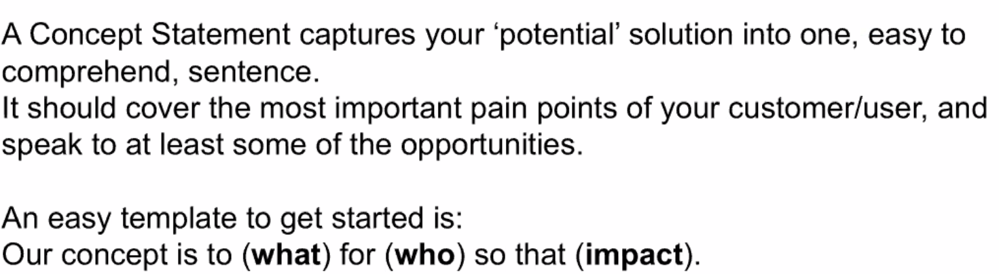
Elevator pitch is generally a problem statement followed by a concept statement. 

Consider targetting early adaptors *within* a target population. 

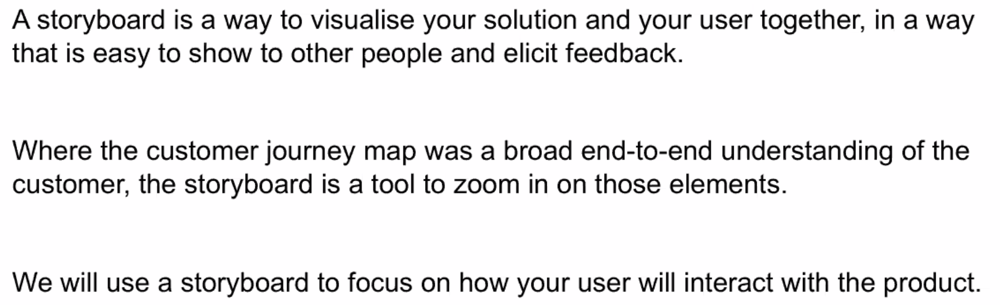
Storyboard holds a lens over a part of the customer journey map. You can pilot this directly in front of your potential customers to get feedback on the truth and convincingness. The storyboard itself can be a way of prototyping.

Rough drawings are actually better than refined at getting feedback - if people see it was mocked together quickly, they're more comfortable brutalising. 

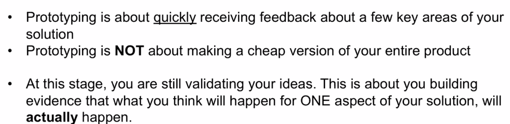
* Zappos - photos of shoes in shoe stores, did it manually
* Dropbox did concierge
* Airbnb rented their own space; and stayed at their first hosts 

## Types of prototyping
1. Role-play/simulation
2. Wireframes
3. Physical prototypes

Pick one crucial element of your idea that is easy to build and easy to feedback on.

Ideo (who were the source of human centered design) have a room full of prototypes so they can remember why ideas work or didn't work

# Martin Schlegel
Board member of Aust. sports tech network (ASTN)

Born global, die local
Sport is global, but still a niche application so have to focus on growing globally and establish a global footprint

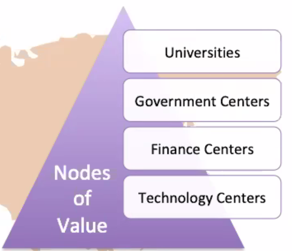
Cluster of innovation. Weak ties between different clusters of innovation. You want to build some of them into 'durable bond', where there is contractual and regular exchanges (doing business together). The next step up is having covalent bonds, where you are doing joint projects etc. These are win-win relationships. 
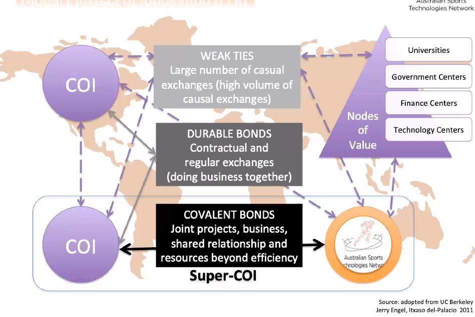
Israel and silicon valley are an example of a Super-COI relationship.

## Causes of start-up failure
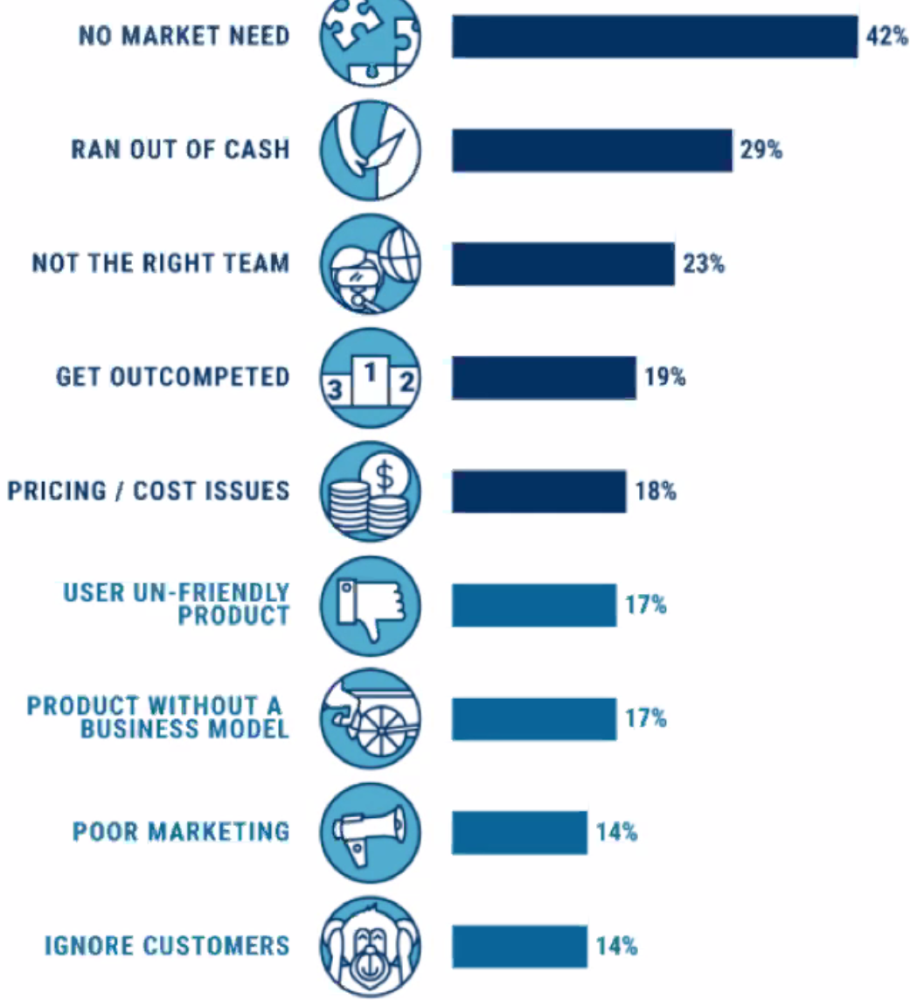
Therefore, most important thing is customer discovery. 
Ansoff matrix: innovation is not just about R&D/product development
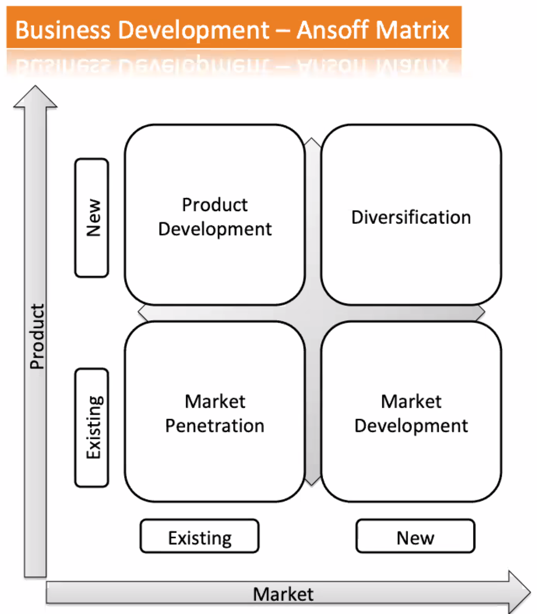

A startup is a temporary organisation in search of a scalable, repeatable, profitable business model.

Access the world of widely distributed knowledge - 'none of us is as smart as all of us' - Henry Chesbrough, Barkeley Haas

You can do this by connecting openly with your supply chain (Open innovation 1.0): 
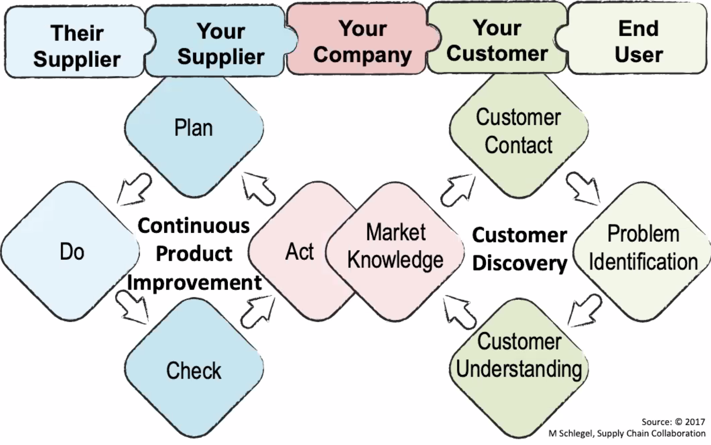
An advanced way (Open innovation 2.0):
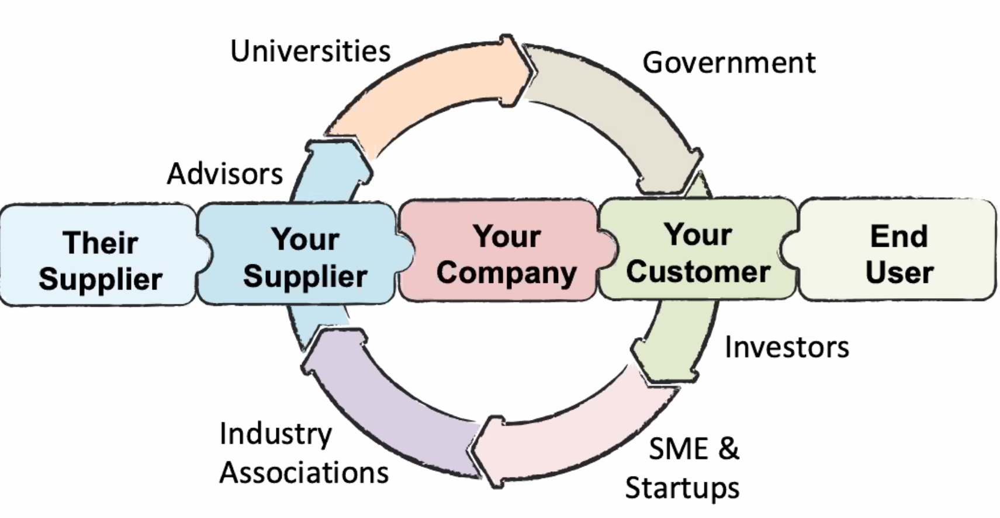
For example in sports tech ecosystem:

E.g. LaunchVic looks after a range of angel investors
Here there is a scale - you can test many opportunities, an intensity - allowing you to test systematically (everyone is concentrated). 

ASTN is running a range of initiatives: 

Who is your customer? How have they validated their customer? What is your business model/monetization strategy? How can you scale it?

Build to grow and hold, or build to exit. 
Their plan is to accelerate, collaborate 
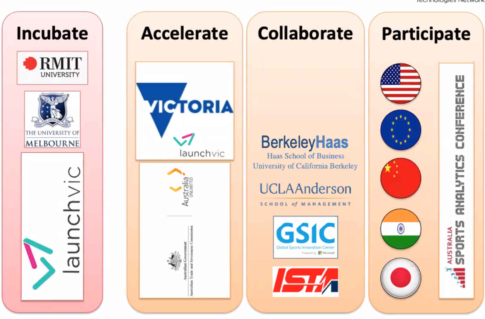
UCLAAnderson gap program - 2x MBA graduates invest time to take your product to market. Access to their connections is helpful.

Landing Pads - there's 5 (TelAviv, Munich, SF, Shanghai and one more). Can get a funded 3 month placement at one of those.

Ecosystem provides an environment for validation (to validate for a paying customer); doing it within an ecosystem allows you to validate better, cheaper or faster than larger companies.

In Australia, the ecosystem is small enough to implement solutions economically. Market is complex enough to later scale and transfer lessons learnt. There's elements of the European, Asian and American markets here. It's typically a long tail market, 'the netflix of the world' - e.g. 4 codes of football, cricket, baseball, etc. People in Australia demand the same level of sophisticated but are willing to trial. 

3M have a saying: an idea is only an innovation if you can turn it into cold hard cash. 
## Technology adoption lifecycle 
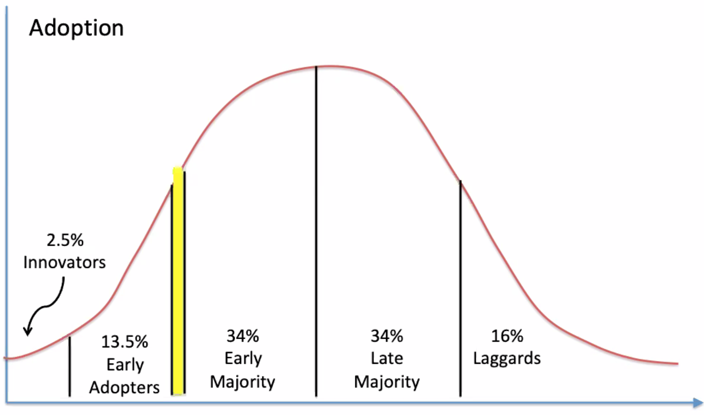
Innovator may buy just because they find it cool. An early adaptor, ties that desire with an interest in getting a business/personal advantage. Both of these groups are people willing to take a risk in case they get a benefit. These two will probably also partner with you to improve your offering as its also to their benefit. The early majority is open to new ideas but don't want to be the guinea pig - they want to be sure that a product works. The late majority, for example, have an incumbent supplier so they are only talking to you to either drive down the price of their current supplier or to be convinced you're substantially better.

Overcoming the chasm between early adaptors and early majority. Need to understand what group the person you are talking to belongs in, ecosystems can help you identify that. 

**Value of sport**
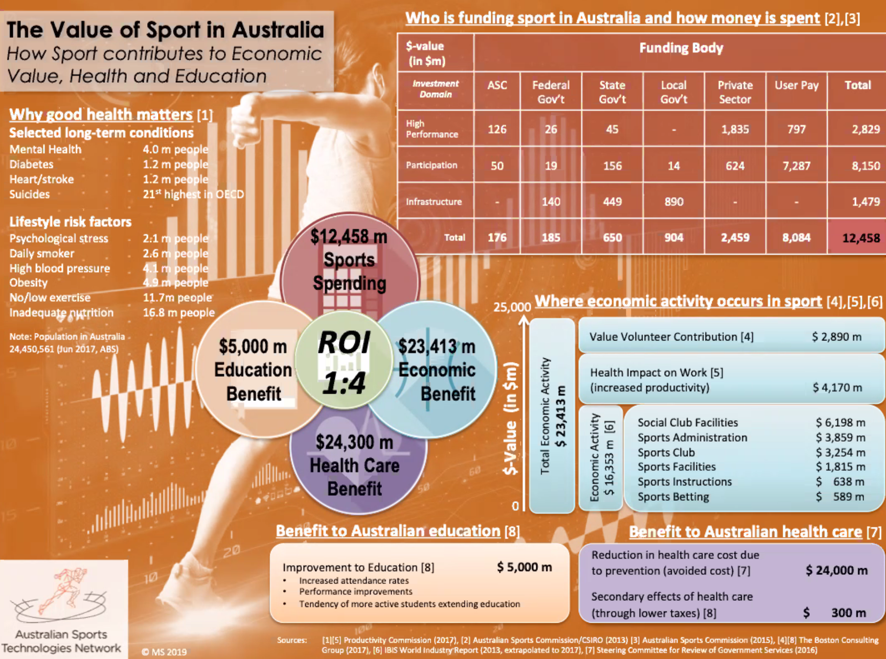

Sport is an interesting validating environment. Earlier in the curve, barrier of entry is lower. You could also validate in sport, and exit into health (not). Companies at either end may seek to transition in either direction. 
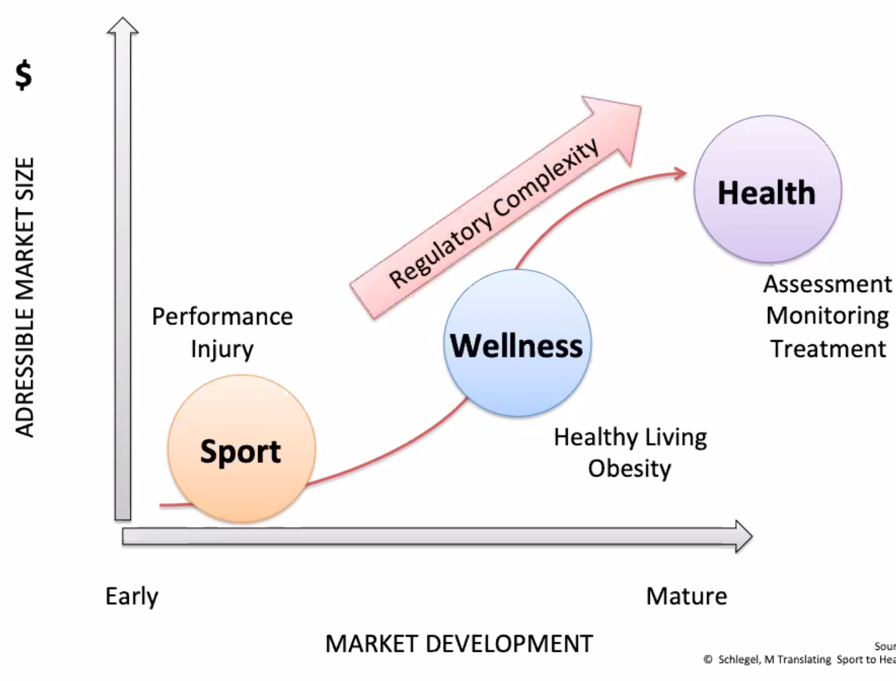. 

## Questions
Currently in sports, a lot of things are being done with invasive technologies. Doing exercise then going to the medication. 

Skill execution alignment to time is difficult, i.e. if you have multiple sensors. Do you use an atomic clock ? Or computer? Accurate enough? What if battery runs low? 

Dorsavie - sensor (sensor at the back of spine, initially for skill execution in sport which has transitioned to workcover posture; now to USA). Attracted a lot of money. Workcover will subsidise a device to an injured worker. 

You can't really prevent the issue around IP unless you have an early discussion with someone. Pub test - what are you willing to put on your website to advertise what you are doing ? You need to expose enough for someone to be willing to talk to you? Otherwise, if you want to insource an idea, think about how you can collaborate? Can you get that person onboard? Can you make that person a business partner? Can you license that in? If so, can't pay that much - limit application to your sector (so you don't tie it down), and an agreement to only pay once it is generating revenue. 

You should always just work on the notion that there is someone always somewhere in the world looking at building something similar to what you are, so just focus on the batter/cheaper/whatever you are shooting for. 

# Lunch-n-learn
Brandillo
## Fundamentals
1. Have a clear value proposition
2. Know your business model
3. What's the investment output - what will you dowith their money. Here we are today, this money will get us to X. Be specific - you'll get 2 devs that will get your tech to Y by Z date, allowing your sales people to start selling to C. 
4. Find your champion - most important for them - warm referrals.
5. Valuation - if you've taken money before. Champion is a good person to discuss this. At early stage - don't go so low you get diluted or so high that you can't justify.

Angels want to get in at 3 million and under

Capital raising process is a full time job, so unlikely to be able to grow your business during that time. They paid $100 for a designer ot look at their pitch and deck. Due diligence - they want testimonials, to look at the tech etc

Trust your instincts - don't get into bed with the devil. If someone pulls out, others may think they they knew something they don't. 

Beware of fixed costs like lease etc. 

Don't give up more than 15-20% of the business per round.

# Resources
## Convergent and divergent thinking
* Divergent thinking is blue sky, exploratory phase - convergent is more reflective and about making decisions. 
* Metaphor of reaching up to the ceiling and then trying to touch your toes. Can't do both at the same time
* Separate the two processes

## Design thinking videos
### Prototype
Fourth design thinking phase, where we make some form of what we are hoping to put out. We are aiming to explore to make sure the problem we have identified, ideated on and tried to solve is actually the right problem. It might be physical, low fidelity, high fidelity, wireframe, walk-throughs (particularly for service design) etc. We want to inspire our customers to converse with us and find out if it is meeting the needs and creating the feelings in the humans we are designing for. 

Need to embrace failure for this. You need to be comfortabel to iterate and revisit past phases (empathy, define, ideate).

### Test
This is time to refine our problem-solutions based on what we learn. Hopefully, we solved the problems we identified in the first phase. Remember, some things ar never 'finished' (like a website).

You might do a screening, launch (like a website), publish, print, debug, ship, promote, release, beta

## Rapid proto-typing
[Google](https://youtu.be/JMjozqJS44M)
The fidelity of prototype should match the fidelity of your thinking - so prototype early and often. Sketches can be fast but difficult to simulate interactions. To do that, you can move from sketches to paper prototyping
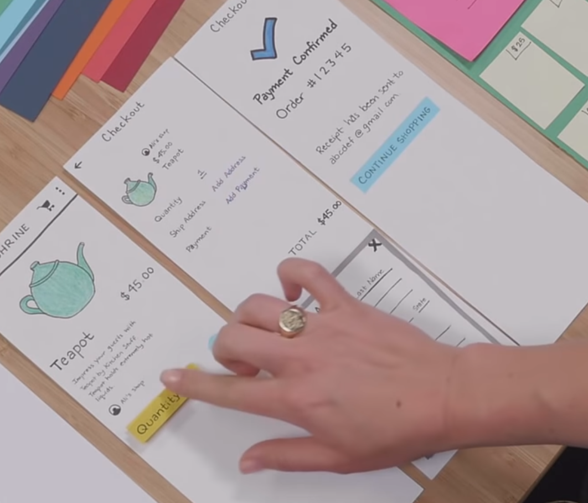
You can also print it or take a couple of stills and use google photo's 'auto-awesome' to createa  GIF of the interaction.

Be purposeful about colour choice - use one primary colour and 1 or 2 accent colour. 

### Digital prototyping
Some tools include Atomic, pixate, form, parvel, p, invision
They used one called 'Principle' and Form. 

### Native prototype
Using it to build and test something in the real world
You need a 'hackers mentality', use low-commitment code, experiment with libraries that may or may not make sense. 

## 10 tips for user testing your prototype
[Source](https://digitalskillsglobal.com/blog/10-tips-for-user-testing-your-prototype)
1. Get strangers to tryi t out and have a third party record and document their experiences. Get 3-10 fresh pair of eyes.
2. Ask  users to complete tasks using your prototype
See if they can get it to actually acheive their goals. 
3. Remember some parts can be non-functioning, just explain what will go there
4. Use realistic, non-distracting data/images/icons so that dummy data etc doesn't distract from the purpose
5. 'It would be great if...' Give them plenty of opportunities to communicate their thoughts, frustrations, the 'what ifs ' which occurred to them.
6. Use heat maps to show where users are actually going rather than where oyu think they should
7. Test the product in all environments that the user will use it in
8. Think about your audience, gender, age, culture, and any other potential variations in how people may use your prototype

## Usability and UX study
### Research methods available in different situation
[Source](https://youtu.be/OtUWbsvCujM)
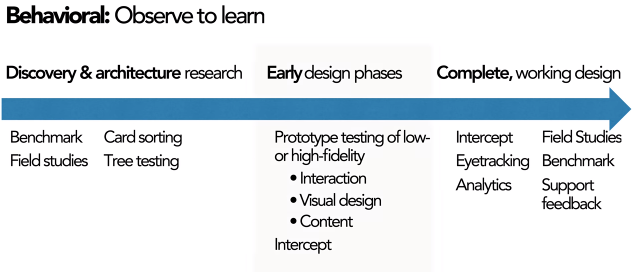
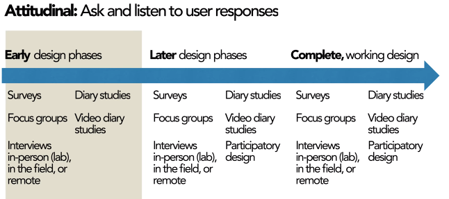
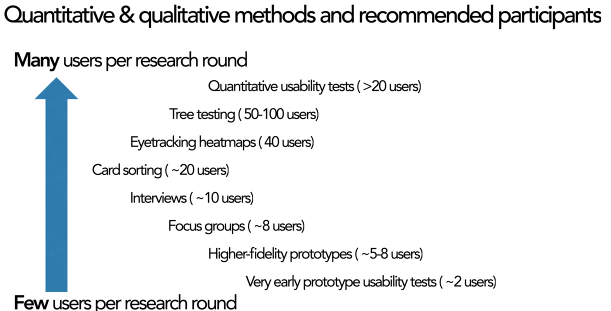
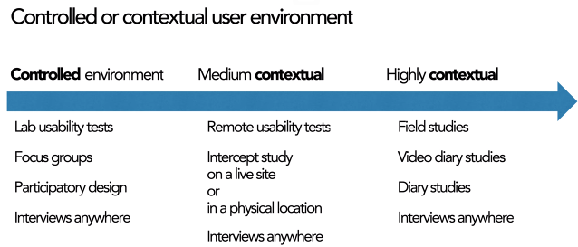

## An exercise 
[Source](https://www.youtube.com/watch?v=_vS_b7cJn2A)
Nodes and links = sysetms model (example was sketches of the toast-making process)
Between 5 and 13 nodes is the sweet spot
If they sketch using post-its or cards, the drawings tend to get better/more thoughtful than on a single page
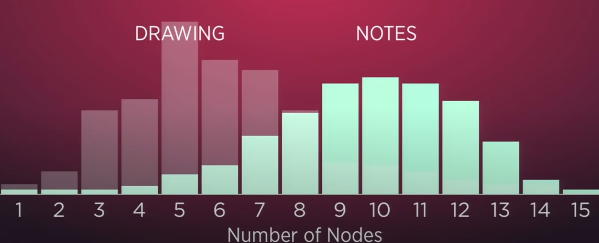
If we do it as a group, we get much more nodes but there is no 'map shock' because people participated. The diagrams also end up a little more complex to capture diversity so sometimes you see branching etc. 

Interestingly, they get it done much faster and better if they do it in silence.

Make your designs visible, tangible and consequential

[Ref](drawtoast.com)

## Research Through Design
[Source](https://www.interaction-design.org/literature/book/the-encyclopedia-of-human-computer-interaction-2nd-ed/research-through-design)

## Software recommendations
Pencil Project (Firefox extension)
Adobe Xd
Mockplus

## Rapid prototyping in Google Glass
[Source](https://www.youtube.com/watch?v=d5_h1VuwD6g)
### Prototyping rules
2. The best way to think is by doing. 
3. Use materials that move at the speed of thought - example was using clay with the same weight as the electronics that could be placed at different parts of a coat-hanger prototype of google glass