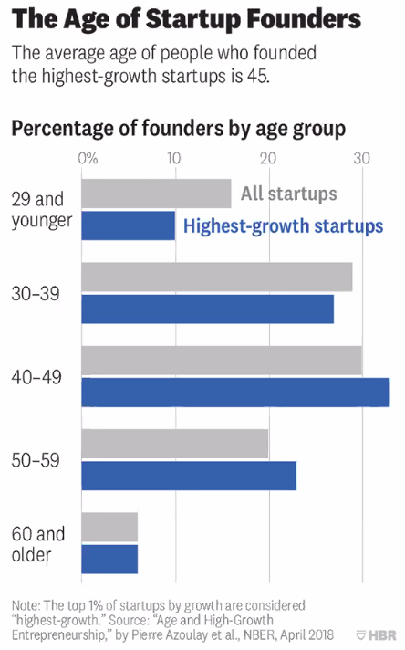
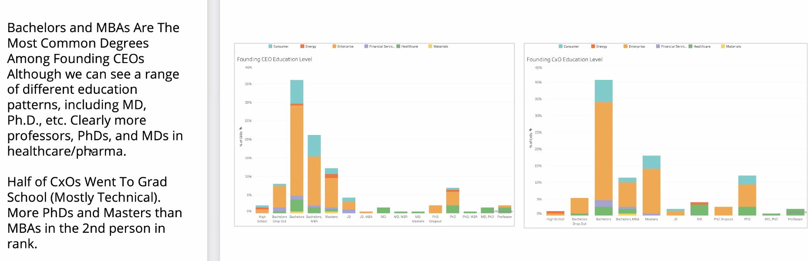

# What makes a good founder
Andreas Birnik - Antler, >130. Deep tech, PhD cranfield
What VCs are looking for
Fortune City 1999
Elivo; C3 urban 

Looking for people with genuine interest who have done a variety of things that ; or domain expertise with strong executers; career trajectory (# of years available to them versus what have they achieved), strong inner drive, ability to inflence, lead and problem solve. 

CEO with same-sector experience vastly outperforms other CEOs (56 vs 83%); 
Triple-A such as MBA etc helps - 20% vs 34%
54% of funded CEOs are immigrants
80% have international experience

6-10 years is the sweet spot

Average team size of 2.1

VCs expecting a lot of their companies to fail, so they need founders aiming very high. 'Go big home', willing to make big bold gutsy bets. 
Babe ruth - I swing as hard as i can and I try to swing right through the ball. Swing big, with everything I've got. I hit big or I miss big. 

## Hyper-performers

GRIT is key for hyper performance - they have extra-ordinary stamina. Passion and perseverance. 
Demonstrating grit - tell your story about the setbacks, what you learnt from it, how did you find out something wouldn't work, how quickly did you take action

## Traits

## Thinking patterns & Experience

Trust your own ideas but can listen so don't get stuck on j ust one possibility and are very aware of the tools available to you. 

In general, ventures that are run by  people with prior entrepreneurial experience have superior profits. Previous experience in self-employment also increases. 

## Teams

## Founder-market fit

You can leverage your team to convey obsession and competence within a problem, even if you don't have it as personal experience. 

Speed, grit, founder story, personality to connect with peers and customers. Driven by obsession. 

## Compelling founder story

## Experience versus business type

The more you are selling directly, the more likely people are to check your LinkedIn etc. 

## Unicorn co-founders

20-40 year old sweet spot

Complexity of the area probably influences but also in the B2B health space, you are evaluated as a person (founder) so  higher barrier. Credibility very important.

Study both money flowing into the sector in terms of investment but also acquisition. Try and paint the picture that this is a hot field where there is both. 

You are initially setting up a team - who is going to be in the helicopter as you go on the initial 

turns out, just working at a start-up does not help. 
Need to be in the drivers' seat. 

## Quotes
### Grit

### Adaptability

### Visionary

### Optimism

### Focus

### Avoiding perfectionism 

### Comfortable with not being in control

### Paranoia

### Fake it until you make it 

### preparation

### Questions
* Structured serendipity - people coem together and we facilitate networking, stress-testing those teams for congruence. 
* The market always wins: you have to be in an active market; in 5 years of raising series A, does this start-up have a snowball's chance of making $100,000,000. This is what VC are thinking, in particular. If it's super niche, we won't be interested - but if it's niche, the question is whether you can expand beyond that niche once you secure it? Capital Health (radiology clinics), >80 clinics - how can we expand? Pathology? 
* A team that makes meaningful progress week on week is the good sign. Those are the ones using their time effectively. 
* Africa - lots are building B2C businesses whereas Australia has more B2B
* Willing to hustle with their actual customers - book smart but unhappy to talk to actual customers. They want people who are sales orientated. Or we get people to do almost anything under a very short time - are they willing to sacrifice everything for even a short term (80-100 hour weeks). 

## Links
[Part 4: The only thing that matters](https://pmarchive.com/guide_to_startups_part4.html)

# Resources
## Invention vs innovation
[Source](https://www.wired.com/insights/2015/01/innovation-vs-invention/)
* Invention is about creating something new, while innovation introduces the concept of “use” of an idea or method.
*  We can dissect the iPhone into individual inventions and evolutionary consolidations of other gadget functions and features.  There are really no ground-breaking inventions from a technical perspective, in the first (or second, or third) generation iPhones. Was the iPhone a great innovation? Absolutely.The iPhone created an ecosystem of media content, telecommunications, licensing, application development, and unified them all under one roof.
* Very few inventions are, by themselves, successful innovations.  Most innovations are evolutionary changes to existing processes, uses, or functions, which are made better by one (or several) contributing inventions.
* Isaac Asimov (the science fiction writer) wrote an interesting letter in 1959 as part of a group doing research for ARPA (the US government’s Advanced Research Projects Agency), recommending “cerebration sessions” to promote innovation beyond invention.  He identified shared thinking and informal collaboration as a key component of problem solving and accelerating change. Rather than lecture sessions where the presenter proves how smart he is by showing his results and finished work products, the cerebration sessions are used to “group think” new ideas, new possibilities, and new combinations of knowledge and experience which could find new answers and new directions.
> But how  to persuade creative people to do so? First and foremost, there must be ease, relaxation, and a general sense of permissiveness. The world in general  disapproves of creativity, and to be creative in public is particularly bad.  Even to speculate in public is rather worrisome. The individuals must,   therefore, have the feeling that the others won’t object. –Isaac Asimov
* Creating a corporate culture where the goals are measured in simplified KPIs and easily measured metrics might actually stifle innovation in many ways. 
> But innovation comes from people meeting up in the hallways or calling each other at 10:30 at night with a new idea, or because they realized something that shoots holes in how we’ve been thinking about a problem. –Steve Jobs
* Companies successful in innovation:
    * The first is the culture of cerebration, of promoting employees to share and internally market their ideas and projects.
    > It’s best to work in small teams, keep them crowded and foster serendipitious connections. –Eric Schmidt and Jonathan Rosenberg; How Google Works
    * Keys to success include leading from the front instead of “managing down”, listening to and encouraging new ideas, and leveraging the years of experience and knowledge at “the top” of the company to support the teams of smart creative employees and help to push their ideas “up” to become products and innovations.

## Ideas to solutions
[Part 1](https://hatrabbits.com/en/crazy-idea-to-feasible-solution-1/)
[Part 2](https://hatrabbits.com/en/crazy-idea-to-feasible-solution-2/)
There is a methodology for converting crazy ideas from brainstorm into realistic plans. Example is a brainstorm to stop a brain-drain to a competitor. Crazy idea: *“If an employee threatens to resign, we will kidnap a family member and demand that he/she stays.”*

### Method 1: Find the concept
1. Extract the concept: What is the concept (the leading thought) behind the idea? Often there are multiple concepts to be found. Try to map them all, and then choose the one that appeals to you the most.

The concepts behind the above could be: 
* Pressurise an employee to stay
* Involve family members to retain employees
* Convince an employee to stay for other reasons than his own (financial) interest
* Perform ludicrous action to ensure that an employee returns to the company
* Act proactively to prevent employees from resigning

2. Choose the concept that appeals msot and create alternatives
e.g. could select “Act proactively to prevent employees to resign”, which generates new ideas like: 

* Reward good performances with a small personal gift, e.g. a book, theatre voucher or a beloved sweet. (An unexpected gift has an emotional value and can lead to loyalty towards the company)

* Reward employees for their dedication, regardless of their performance. (Making employees feel important and valued can compensate for a lower salary)

### Method 2: Use the benefits
1. List all the benefits: all aspects of the crazy idea that have a positive inflence on solving the problem. E.g., in above kidnapping idea, benefits include: 

* Employees want to continue working at your company (to make sure it ends well for their family)
* Employees want to keep you happy and don’t leave the company (as long as you keep their family member hostage)
* Employees are no longer worried about a higher salary (they have more important things on their mind)
* Employees are afraid of the consequences of leaving the company
* Employees are very aware of the benefits of staying
Social pressure (from other family members) to stay
The kidnapped family member can work (and make money for us) during the kidnapping

2. Pick one benefit and generate realistic alternate ways of achieving that benefit

E.g. “Social pressure (from other family members) to stay.”

* Invest in the company’s ‘one big family’ feeling (you want to stay part of it)
* Invest in colleague friendships (through team building activities)
* Set up a platform where colleagues can give each other positive social pressure, by stimulating people to take up personal challenges (like learning a new skill or running a specific project). Once employees have started something new, they’re more like to finish it.
* An anonymous tip line where you can ‘snitch’ colleagues you suspect of switching. These colleagues can be subtly approached with the message that there are alternatives options within the organization.

### Method 3: Imagine what would happen if the idea would be executed and use this scenario as input for new ideas.

E.g. 
* We choose a family member (one that he or she is fond of)
* We track the family member down, kidnap him or her (and hide them somewhere where they can’t easily be found)
* We write a kidnap-note for the employee (by cutting out letters from newspapers)
* We hand over the kidnap-note to the employee
* We need evidence (we could cut off a finger or take a picture with the victim and today’s newspaper)
etc.

#### Storyline: We track family members down and kidnap them
> Idea 1: We track the employees down who are thinking about leaving and offer them a better contract.
> Idea 2: We track down the competitors who are ‘stealing’ our employees and analyse their company (for example, by talking to their current or former employees). This way we could map out their shortcomings and use this information to become a more attractive employer.
#### Storyline: We need evidence
> Idea 1: We need evidence that we are a better employer, or in other words; we need to become a better (more popular) employer. We can become a better employer by investigating what our employees are looking for in a job (e.g. via a survey) and by using this information to improve our employment conditions.
> Idea 2: Cutting off employees who are not loyal. We could create a more loyal group of employees, by putting emphasis on ‘loyalty’ as an important criterion during the recruitment phase.

## Board of innovation
[Board of innovation resources](https://www.boardofinnovation.com/staff_picks/our-favorite-ideation-tools/)
[Board of innovation video](https://www.youtube.com/watch?time_continue=4&v=UmHYeD06XsU&feature=emb_logo)

Ideation is the start of solution development; without the first two steps, you are just doing ideation theatre

If running an ideation workshop; have a breadth of staff present. Don't take less than 6 participants. 1 experienced facilitator for every 15 participants. Groups to 5-6 people probably ideal. 

Do it in a space that sparks creativity; have enough food and drink

1. Suggest people adopt a 'Yes, and..' mindset rather than 'Yes, but'
2. Recrd everything - use marker (more visible but also forces more concise), be visual (so sketch) 
3. Hybrid brainstorming - to avoid group-thinking; everyone brainstorms individually first and then share. Need to accommodate for enough time to have a group discussion. 
4. Quantity over quality 

Next steps guided by:

A good 'how might we' statement is one where the problem space is clearly defined but the solution is not. Two tools:

* Brain writing - 
    1. Everyone puts forward their idea
    2. Everyone else adds to it - e.g. that makes me think of... it can also... to build on that..
So you give a poster to every participant, get them to write the how-might-we at the top; for 5 minutes everyone ideates on their own, puts each idea on a post-it and sticks it on the poster. Then everyone passes the poster to their neighbour for another 5 minutes of private brainstorming, this time adding on to the  neighbour's poster. 

After a few rounds, have a group discussion about ideas and add new ones. 

* Opposite thinking - fun but harder. 
    1. Divide a paper into 3 columns
    2. First column, write all your assumptions about a concept or domain
    3. Describe the opposite of these assumptions
    3. Describe a new service, offeringo r improvement stemming from the opposite 

Now all of divergence has come, for convergence, one approach is the 'idea shopping cart'; each participant shortlists a few. Give peple criteria to push some to th top.

Finally, get the participant to create one concept card of each of the ideas they are pushing to make it more tangible and make it easy to store. Then there is a final round of idea sharing; potentially as a speed-dating session where each person presents their idea in 1-1.5 mins to a partner. 

Need to keep the energy levels high throughout, maybe using games. Finally, you need to have follow-up from your ideation session. You should already know 1. Why we are doing this; 2. How will we be taknig this forward; 3. What is your role in taking this forward?

Finally, get feedback with a 'I liked...' and 'I wished...' slide; one of each from everyone.

## 8 UX ideation tricks 
[Source](https://uxplanet.org/8-ux-ideation-techniques-to-try-out-3894ca301a07)

## Storyboarding and challenging assumptions
[Text](https://www.ibm.com/design/thinking/page/toolkit/activity/storyboard)
[Video that explains the challenge of assumptions](https://www.youtube.com/watch?time_continue=8&v=Yv1Y_9rhink&feature=emb_logo)

## Design research vs market research
> Design research is a collection of activities that seek insight into user behaviour, goals and needs. The end goal is resolving these through design.

Market research is for confirming what you're looking for, design is for diving deep. The benefits of having an extensive conversation far outweigh mass polling with generic questions.

## Market research vs user research
[Source](https://uxstudioteam.com/ux-blog/market-research-vs-user-research/)
* User research aims to find people’s true pain points and motivations based on their behavior. However, market research aims to find people’s attitudes towards a product and estimate the size of the potential market.
* Market research tends to give more weight to attitudinal data (what people say about themselves or about what they would do) rather than to concrete behaviors in a certain context. They use insights from market research primarily to inform marketing decisions.
* User research looks at people’s behavior, how they solve everyday problems, use a product, etc. It does not deal with broad data, but rather very specific, deep insights regarding users.
* Apply market research early in the product development cycle to analyse the products' potential to make money

## PESTLE Analysis
[Video](https://www.youtube.com/watch?time_continue=1&v=GFVKKTwkANY&feature=emb_logo)
Political: government policies, political stability, tax regs, industry regs, global trade agreements and restrictions  
Eceonomic: Exchange rates, globalisation, inflation, interest rates, labor costs, consumer spending, cost of living  
Social: Lifestyle choices, cultural expectations like worklife balance, consumer tastes, buying habits, demographics  
Technology: How is your business responding to technological innovations
Legal: Shifts in the legal landscape, employment labor laws, OH&S
Environmental: Corporate social responsibilities, etc

## Porters 5 forces model
[Source](https://www.cleverism.com/porters-five-forces-model-strategy-framework/)
The Porter’s five forces model is often used as a starting point to evaluate a company’s position in its industry and to assess its level of competitiveness.

Five forces to determine, divided into two groups:
1. Horizontal forces: Threat of substitutes, threat of new entrants, competitive rivalry
2. Vertical forces: Bargaining power of buyers and bargaining power of customers

### Competitive rivarlry 
Degree of rivalry between existing companies in the market. Competitive rivalry may be higher when:
* Similar sized companies operate in one market
* These companies have similar strategies
* Products on offer have similar features and offer the same benefits
* Growth in the industry is slow
* There are high barriers to exit or low barriers to entry 

### Threat of new Entrants
* If an industry is profitable, or attractive in a long term strategic manner, then it will be attractive to new companies. Unless there are barriers to entry in place, new firms may easily enter the market and change the dynamics of the industry. The most attractive scenario for a new company is when a potential market has low barriers to exit but high barriers to entry.

Barriers to entry may stem from things like:
* patents and proprietary knowledge
* access to specialized technology or infrastructure
* economies of scale or government driven obstacles
* high initial investment needed
* high switching costs for consumers, loyal consumers
* difficulty in accessing raw material and difficulty in accessing distribution channels

### Threat of Substitutes
Substitute products are those that exist in another industry but may be used to fulfill the same need. The more substitutes that exist for a product, the larger the company’s competitive environment and the lower the potential for profit. A high threat of substitutes will impact a company’s ability to set prices that it wants. If a substitute is priced lower or fulfills a need better than it may end up attracting consumers towards it and reduce sales for existing companies.

The threat of substitutes is affected by factors such as brand loyalty, switching costs, relative prices, as well as trends and fads.

### Bargaining Power of Buyers
When buyers have the power to affect prices in an industry, it becomes an important factor to consider for a company.

When is buyer power high?

Buyers tend to have power over an industry if they are important to the company, this may be if the industry is such that buyers either buy in bulk, or can easily switch to another supplier. A limited number of strong buyers may be able to exert significant control over a seller. In addition, if a product is similar to its competitor with little or no differentiation, then there are chances that the company may need to let the supplier dictate terms in order to avoid losing the customer.

### Bargaining Power of Suppliers
When do suppliers have power?

Supplier may enjoy more power if there are less of them. Costs of switching to an alternate are high, or there are no alternates. A supplier may also be the only provider of a certain raw material. This may be the case in instances where a supplier holds a patent or have proprietary knowledge. Because of a lack of alternates, they may be able to withhold quantities or increase prices without losing sales. 

### Seps:
1. Gather info on each force
2. Analyse results and display in a diagram
3. Formulate strategy based on conclusion

### Rules
Before: understand he scope, audience and open in your brainstorming
During: Keep the focus on the future, ignore what could have ben better in the past. Analyse positives and negatives.

Remember it is to be used for an entire industry, not an individual company. 

## Market dynamics
[Slides](/resources/start-up market dynamics.pdf)

## Industry Map
[PDF](/resources/industry_map.pdf)

## Total addressable market
[Source](https://www.toptal.com/finance/market-sizing/total-addressable-market-example)

## Market segmentation
[Source](https://buildsuccessfulstartups.com/market-segmentation-examples/)

## Identifying the target market
[Source](https://www.quicksprout.com/how-to-identify-the-target-market-of-your-startup/)

## Competitor Analysis
[Source](https://venngage.com/blog/competitor-analysis-template/)

## Unfair advantage
[Source 1](http://ask.leanstack.com/en/articles/904720-what-is-an-unfair-advantage)
[Source 2](https://www.inc.com/chris-heivly/14-unfair-advantages-you-don-t-realize-your-startup-has.html)

